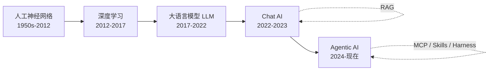
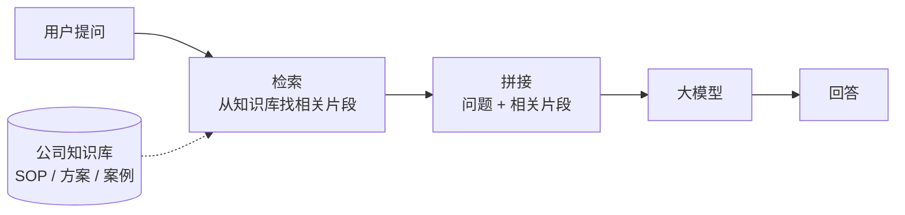
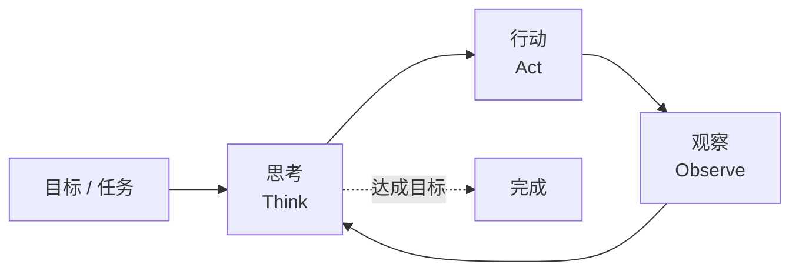
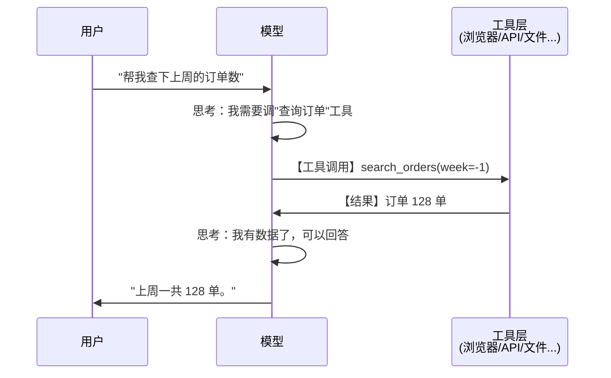
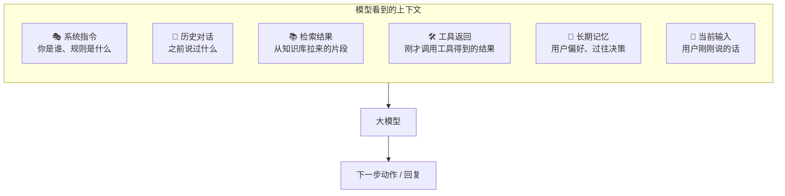
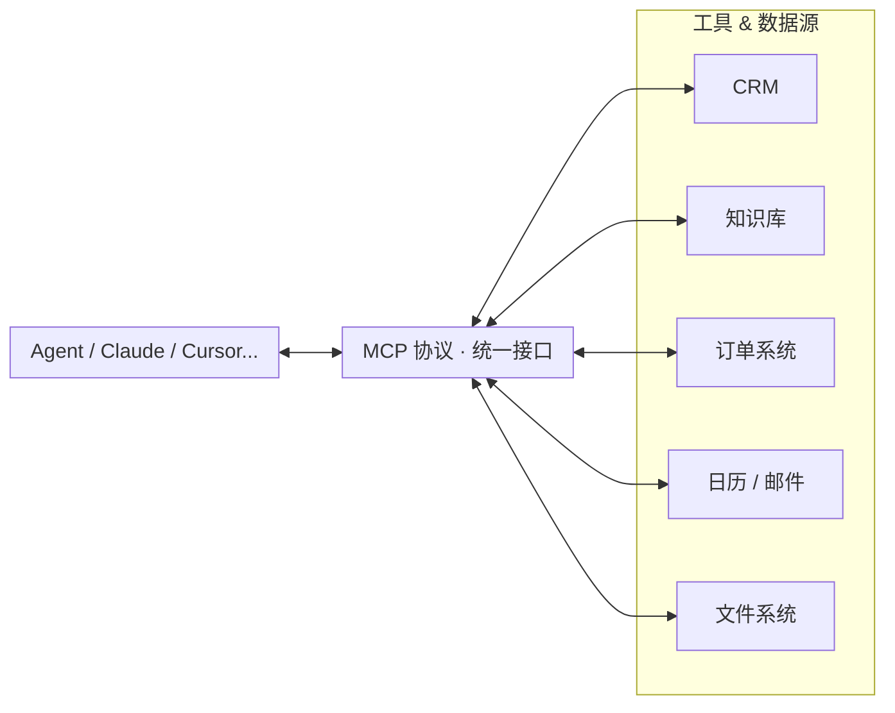
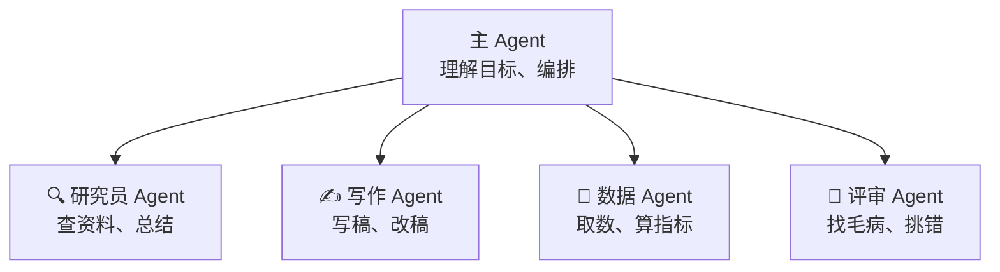
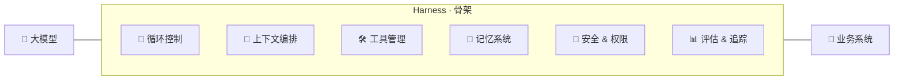
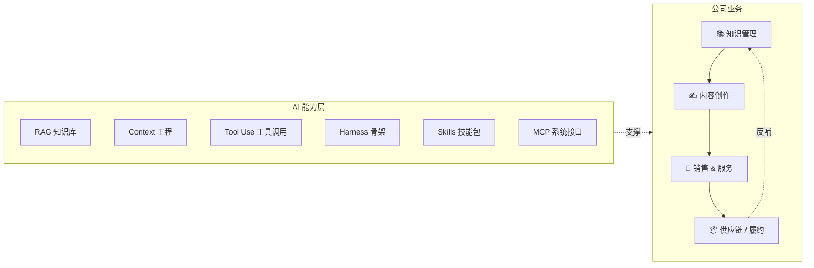

# 认识 <span class="term" data-zh="自主式 AI">Agentic AI</span>

从神经网络 → 生成式 AI → 智能体

<div class="pt-4 text-sm opacity-75">
  川叶 · <a href="mailto:riverscn@gmail.com">riverscn@gmail.com</a>
  <div class="pt-2">
    <a
      href="https://github.com/riverscn/intro-agentic-ai"
      target="_blank"
      rel="noopener noreferrer"
      title="GitHub 源代码"
      aria-label="GitHub 源代码"
      class="inline-flex items-center gap-2 opacity-80 hover:opacity-100"
    >
      <svg xmlns="http://www.w3.org/2000/svg" viewBox="0 0 24 24" class="w-5 h-5" fill="currentColor" aria-hidden="true">
        <path d="M12 .5C5.649.5.5 5.649.5 12a11.5 11.5 0 0 0 7.863 10.923c.575.106.787-.25.787-.556 0-.274-.01-1-.016-1.962-3.2.696-3.875-1.542-3.875-1.542-.523-1.33-1.277-1.684-1.277-1.684-1.044-.714.08-.7.08-.7 1.154.081 1.761 1.185 1.761 1.185 1.026 1.758 2.692 1.25 3.349.956.104-.743.402-1.25.731-1.538-2.554-.291-5.24-1.277-5.24-5.685 0-1.256.448-2.284 1.183-3.09-.119-.291-.513-1.463.113-3.049 0 0 .965-.309 3.162 1.18A10.99 10.99 0 0 1 12 6.067c.977.005 1.961.132 2.88.387 2.195-1.489 3.158-1.18 3.158-1.18.628 1.586.234 2.758.115 3.049.737.806 1.181 1.834 1.181 3.09 0 4.419-2.691 5.39-5.253 5.676.413.355.781 1.057.781 2.131 0 1.538-.014 2.779-.014 3.158 0 .309.208.668.793.555A11.503 11.503 0 0 0 23.5 12C23.5 5.649 18.351.5 12 .5Z"/>
      </svg>
    </a>
  </div>
</div>

<div class="pt-12">
  <span class="px-2 py-1 rounded cursor-pointer opacity-70 hover:opacity-100" hover:bg="white op-10">
    面向全公司 · 不假设任何 AI 背景
  </span>
</div>

<!--
这场分享的目标是"认知拉平"——不是培训工程师怎么写代码，而是让所有岗位的同事对同一个词有同一个画面感。
-->

---
layout: center
class: text-center
---

# 这场分享想解决什么

不是"学一个工具"，而是**把大家对 AI 的心智模型对齐**

<div class="grid grid-cols-3 gap-6 pt-10 text-left">

<div class="p-4 rounded border border-gray-500 border-opacity-30">
<div class="text-2xl">🧭</div>
<div class="font-bold pt-2">一张地图</div>
<div class="text-sm opacity-70 pt-1">从神经网络到 <span class="term" data-zh="智能体">Agent</span>，这些词之间到底什么关系</div>
</div>

<div class="p-4 rounded border border-gray-500 border-opacity-30">
<div class="text-2xl">🔍</div>
<div class="font-bold pt-2">一个直觉</div>
<div class="text-sm opacity-70 pt-1">AI 为什么"能聊天、会思考、还能操作电脑"</div>
</div>

<div class="p-4 rounded border border-gray-500 border-opacity-30">
<div class="text-2xl">🧩</div>
<div class="font-bold pt-2">一套抓手</div>
<div class="text-sm opacity-70 pt-1">对我们公司的业务，下一步到底怎么用</div>
</div>

</div>

<div class="pt-10 text-sm opacity-70">
听完之后，希望大家跟客户、跟同事、跟老板讨论 AI 的时候，用的是<b>同一套词</b>。
</div>

---
layout: center
---

# 先来一张"全景图"

<div class="pt-4">



</div>

<div class="pt-6 text-center text-sm opacity-70">
每一层都不是"替代"上一层，而是<b>在上一层之上</b>加了新能力。<br/>
今天我们一层一层走过来。
</div>

---
layout: section
---

# 第一部分

## AI 是什么：从神经网络说起

<div class="mt-6 pb-12 flex justify-center">
  <video
    src="/images/Walk%20In%20The%20Clouds.mp4"
    controls
    muted
    loop
    playsinline
    class="w-[760px] max-h-[320px] rounded border border-white/20 object-contain"
    onloadeddata="this.play().catch(()=>{})"
  ></video>
</div>

---

# AI 不是一个"东西"，是一类方法

<div class="text-center text-sm opacity-80">
同一个问题——<b>"这张图是猫还是狗？"</b>，两种完全不同的解法：
</div>

<div class="grid grid-cols-2 gap-6 pt-4">

<div>

### ❌ 传统思路：把规则一条条写出来

```python
def 是不是猫(图):
  if 有胡须 and 耳朵尖立:
    if 瞳孔竖直 and 体长 < 60cm:
      if 尾巴蓬松 and 爪有肉垫:
        if 脸型圆润 and 会咕噜:
          return "猫"
        # 但无毛猫没毛...
        # 但折耳猫耳朵不尖...
        # 但布偶猫体长超标...
  # ... 还有几百种例外 ...
  return "不知道 😵"
```

<div class="text-sm opacity-75 pt-3">
👆 <b>写不完，也写不对</b>——<br/>
现实里的"猫"没办法穷举。
</div>

</div>

<div>

### ✅ AI 思路：让它自己看

<div class="p-4 rounded border border-green-500 border-opacity-40 bg-green-500 bg-opacity-5">

<div class="text-center text-2xl leading-tight">
🐱🐱🐱🐱🐱🐱🐱🐱<br/>
🐱🐱🐱🐱🐱🐱🐱🐱 <span class="text-xs opacity-60">← 1 万张标"猫"</span><br/>
🐕🐕🐕🐕🐕🐕🐕🐕<br/>
🐕🐕🐕🐕🐕🐕🐕🐕 <span class="text-xs opacity-60">← 1 万张标"狗"</span>
</div>

<div class="text-center py-1 text-2xl opacity-50">↓</div>

<div class="text-center text-sm py-2 rounded bg-purple-500 bg-opacity-20 border border-purple-500 border-opacity-40">
🧠 神经网络自己找规律
</div>

<div class="text-center py-1 text-2xl opacity-50">↓</div>

<div class="text-center text-sm">
新图片 🖼️ → <b class="text-green-500">"猫 🐱"</b>
</div>

</div>

<div class="text-sm opacity-75 pt-3">
👆 <b>不告诉它"怎么判断"</b>，<br/>
只告诉它"这些是猫、这些是狗"。
</div>

</div>

</div>

<div class="pt-5 text-center text-sm">
<b>关键跳跃</b>：从"程序员写规则" → "用数据训练一个函数"。<br/>
<span class="opacity-70">代价：你说不清它到底学到了什么；好处：它能解决人根本写不出规则的问题。</span>
</div>

---

# 人工神经网络：一个非常朴素的想法

<style>
@keyframes nn-flow {
  from { stroke-dashoffset: 0; }
  to   { stroke-dashoffset: -18; }
}
@keyframes nn-pulse {
  0%, 100% { opacity: 0.25; }
  50%      { opacity: 0.85; }
}
.nn-edge {
  stroke-dasharray: 2 4;
  animation: nn-flow 1.6s linear infinite, nn-pulse 2.2s ease-in-out infinite;
}
.nn-edge.d1 { animation-delay: 0s, 0s; }
.nn-edge.d2 { animation-delay: 0.5s, 0.6s; }
.nn-edge.d3 { animation-delay: 1s, 1.2s; }
.nn-diagram text {
  font-size: 9px !important;
}
.nn-diagram .nn-weight {
  font-size: 10px !important;
}
.nn-diagram .nn-sum {
  font-size: 12px !important;
  font-weight: 700;
}
.nn-diagram .nn-label {
  font-size: 7.5px !important;
}
</style>

<div class="grid grid-cols-2 gap-8 pt-1">

<div>

### 灵感来源
大脑里的神经元——接收信号、加权求和、决定要不要激活。

<div class="flex justify-center py-2">
<svg viewBox="0 0 320 140" class="nn-diagram w-4/5">
  <defs>
    <marker id="nn-arrow" viewBox="0 0 10 10" refX="10" refY="5" markerWidth="6" markerHeight="6" orient="auto">
      <path d="M 0 0 L 10 5 L 0 10 z" fill="#94a3b8"/>
    </marker>
  </defs>
  <line x1="40.5" y1="33.3"  x2="141.8" y2="64.9" stroke="#94a3b8" stroke-width="1.2"/>
  <line x1="41" y1="70"  x2="141" y2="70" stroke="#94a3b8" stroke-width="1.2"/>
  <line x1="40.5" y1="106.7" x2="141.8" y2="75.1" stroke="#94a3b8" stroke-width="1.2"/>
  <line x1="123.7" y1="28" x2="147.2" y2="56.8" stroke="#94a3b8" stroke-width="1.2"/>
  <circle cx="30" cy="30"  r="11" fill="#3b82f6"/>
  <circle cx="30" cy="70"  r="11" fill="#3b82f6"/>
  <circle cx="30" cy="110" r="11" fill="#3b82f6"/>
  <circle cx="118" cy="21" r="9" fill="#64748b"/>
  <text x="14" y="33"  font-size="9" fill="#94a3b8" text-anchor="end">x₁</text>
  <text x="14" y="73"  font-size="9" fill="#94a3b8" text-anchor="end">x₂</text>
  <text x="14" y="113" font-size="9" fill="#94a3b8" text-anchor="end">x₃</text>
  <text x="118" y="24" font-size="9" fill="white" text-anchor="middle" font-weight="bold">b</text>
  <text class="nn-weight" x="95" y="46" font-size="10" fill="#a78bfa">w₁</text>
  <text class="nn-weight" x="95" y="66" font-size="10" fill="#a78bfa">w₂</text>
  <text class="nn-weight" x="95" y="96" font-size="10" fill="#a78bfa">w₃</text>
  <circle cx="158" cy="70" r="17" fill="#a855f7"/>
  <text class="nn-sum" x="158" y="74" text-anchor="middle" font-size="12" fill="white" font-weight="bold">Σ</text>
  <text class="nn-label" x="158" y="101" text-anchor="middle" fill="#94a3b8">求和</text>
  <line x1="175" y1="70" x2="215" y2="70" stroke="#94a3b8" stroke-width="1.2" marker-end="url(#nn-arrow)"/>
  <circle cx="232" cy="70" r="17" fill="#f97316"/>
  <text class="nn-sum" x="232" y="74" text-anchor="middle" font-size="12" fill="white" font-weight="bold">f</text>
  <text class="nn-label" x="232" y="101" text-anchor="middle" fill="#94a3b8">激活</text>
  <line x1="249" y1="70" x2="279" y2="70" stroke="#94a3b8" stroke-width="1.2" marker-end="url(#nn-arrow)"/>
  <circle cx="290" cy="70" r="11" fill="#10b981"/>
  <text x="306" y="73" font-size="9" fill="#94a3b8">y</text>
</svg>
</div>

<div class="text-xs opacity-70 text-center -mt-1">
一个神经元 = 加权求和 → 激活 → 输出，写成公式就是 y = f(Σwᵢxᵢ + b)<br/>
大白话：几个信号进来，各自按"重要性"打折相加，<b>超过门槛就开火</b>。
</div>

</div>

<div>

### 串成"网络"：每一层抽象一点
千万个神经元分层堆起来，每条线是一个<b>可调节的参数</b>。<br/>

<div class="flex justify-center py-1">
<svg viewBox="0 0 300 175" class="nn-diagram w-full max-w-sm">
  <g stroke="#8b5cf6" stroke-width="1" fill="none">
    <line class="nn-edge d1" x1="40" y1="35"  x2="150" y2="20"/>
    <line class="nn-edge d2" x1="40" y1="35"  x2="150" y2="60"/>
    <line class="nn-edge d3" x1="40" y1="35"  x2="150" y2="85"/>
    <line class="nn-edge d1" x1="40" y1="35"  x2="150" y2="110"/>
    <line class="nn-edge d2" x1="40" y1="35"  x2="150" y2="150"/>
    <line class="nn-edge d3" x1="40" y1="85"  x2="150" y2="20"/>
    <line class="nn-edge d1" x1="40" y1="85"  x2="150" y2="60"/>
    <line class="nn-edge d2" x1="40" y1="85"  x2="150" y2="85"/>
    <line class="nn-edge d3" x1="40" y1="85"  x2="150" y2="110"/>
    <line class="nn-edge d1" x1="40" y1="85"  x2="150" y2="150"/>
    <line class="nn-edge d2" x1="40" y1="135" x2="150" y2="20"/>
    <line class="nn-edge d3" x1="40" y1="135" x2="150" y2="60"/>
    <line class="nn-edge d1" x1="40" y1="135" x2="150" y2="85"/>
    <line class="nn-edge d2" x1="40" y1="135" x2="150" y2="110"/>
    <line class="nn-edge d3" x1="40" y1="135" x2="150" y2="150"/>
    <line class="nn-edge d1" x1="150" y1="20"  x2="260" y2="65"/>
    <line class="nn-edge d2" x1="150" y1="60"  x2="260" y2="65"/>
    <line class="nn-edge d3" x1="150" y1="85"  x2="260" y2="65"/>
    <line class="nn-edge d1" x1="150" y1="110" x2="260" y2="65"/>
    <line class="nn-edge d2" x1="150" y1="150" x2="260" y2="65"/>
    <line class="nn-edge d3" x1="150" y1="20"  x2="260" y2="105"/>
    <line class="nn-edge d1" x1="150" y1="60"  x2="260" y2="105"/>
    <line class="nn-edge d2" x1="150" y1="85"  x2="260" y2="105"/>
    <line class="nn-edge d3" x1="150" y1="110" x2="260" y2="105"/>
    <line class="nn-edge d1" x1="150" y1="150" x2="260" y2="105"/>
  </g>
  <g fill="#3b82f6">
    <circle cx="40" cy="35"  r="8"/>
    <circle cx="40" cy="85"  r="8"/>
    <circle cx="40" cy="135" r="8"/>
  </g>
  <g fill="#a855f7">
    <circle cx="150" cy="20"  r="8"/>
    <circle cx="150" cy="60"  r="8"/>
    <circle cx="150" cy="85"  r="8"/>
    <circle cx="150" cy="110" r="8"/>
    <circle cx="150" cy="150" r="8"/>
  </g>
  <g fill="#10b981">
    <circle cx="260" cy="65"  r="8"/>
    <circle cx="260" cy="105" r="8"/>
  </g>
  <text x="40"  y="168" text-anchor="middle" font-size="9" fill="#94a3b8">输入</text>
  <text x="150" y="168" text-anchor="middle" font-size="9" fill="#94a3b8">隐藏层</text>
  <text x="260" y="135" text-anchor="middle" font-size="9" fill="#94a3b8">输出</text>
</svg>
</div>

</div>

</div>

<div class="grid grid-cols-2 gap-4 pt-1 text-sm">

<div class="p-3 rounded bg-gray-500 bg-opacity-10">
<b>训练 = 调参数 × 一百万次</b><br/>
<span class="opacity-80">① 看输出错多少 → ② 朝"让错误变小"的方向挪参数 → ③ 重复</span><br/>
<span class="opacity-60 text-xs">这个过程叫 <b>梯度下降</b>——记住"调参数 × 一百万次"这个画面就够了。</span>
</div>

<div class="p-3 rounded bg-blue-500 bg-opacity-10">
💡 一个现代大模型的参数有 <b>几十亿到上万亿个</b>。<br/>
<span class="opacity-75 text-xs">打个比方：相当于给它<b>上万亿个可调旋钮</b>，训练就是把每个旋钮一点点拧到位——量变带来质变。</span>
</div>

</div>

---

# 深度学习到底是怎么学的？

<style>
@keyframes dl-reward {
  0%, 100% { opacity: 0.45; transform: translateY(0); }
  50% { opacity: 1; transform: translateY(-4px); }
}
.dl-train-step {
  min-height: 64px;
  border: 1px solid rgba(79, 70, 229, 0.22);
  background: rgba(79, 70, 229, 0.08);
}
.dl-step-title,
.dl-step-desc {
  white-space: nowrap;
}
.dl-step-desc {
  font-size: 10.5px;
  line-height: 1.15;
  opacity: 0.66;
}
.dl-reward {
  animation: dl-reward 1.6s ease-in-out infinite;
}
</style>

<div class="text-sm opacity-75 -mt-1">
训练不是把答案「写进模型」，而是把目标变成分数，再反复微调参数。
</div>

<div class="grid grid-cols-[1.28fr_0.92fr] gap-5 pt-3">

<div class="rounded border border-slate-300/35 bg-slate-500/5 p-3">

<div class="grid grid-cols-[1fr_18px_1fr_18px_1fr_18px_1fr] items-center gap-2 text-center">
  <div class="dl-train-step rounded px-2 flex flex-col items-center justify-center">
    <div class="dl-step-title flex items-center justify-center gap-1.5"><span>📦</span><b>喂一批</b></div>
    <div class="dl-step-desc pt-1">样本进模型</div>
  </div>
  <div class="flex items-center justify-center text-slate-400">→</div>
  <div class="dl-train-step rounded px-2 flex flex-col items-center justify-center">
    <div class="dl-step-title flex items-center justify-center gap-1.5"><span>🧠</span><b>它猜</b></div>
    <div class="dl-step-desc pt-1">给出预测</div>
  </div>
  <div class="flex items-center justify-center text-slate-400">→</div>
  <div class="dl-train-step rounded px-2 flex flex-col items-center justify-center">
    <div class="dl-step-title flex items-center justify-center gap-1.5"><span>📏</span><b>看错多少</b></div>
    <div class="dl-step-desc pt-1">算误差/奖励</div>
  </div>
  <div class="flex items-center justify-center text-slate-400">→</div>
  <div class="dl-train-step rounded px-2 flex flex-col items-center justify-center">
    <div class="dl-step-title flex items-center justify-center gap-1.5"><span>🔧</span><b>拧旋钮</b></div>
    <div class="dl-step-desc pt-1">微调参数</div>
  </div>
</div>

<div class="pt-3">
  <GradientDescent3D />
</div>

<div class="text-xs opacity-70 text-center pt-1">
曲面高度 = 这次错得多严重；小球在摸索"下山路"，<b>最低点</b>就是训练的目标。
</div>

</div>

<div class="space-y-2.5">

<div class="rounded border border-blue-400/30 bg-blue-500/10 p-3">
  <div class="font-bold text-[17px]">损失函数：错多少</div>
  <div class="text-xs opacity-75 pt-1"><b>有标准答案时用</b>——比如"这是猫还是狗"。衡量预测和答案的差距。</div>
  <div class="pt-2 text-xs opacity-65">目标：让损失变小。</div>
</div>

<div class="rounded border border-amber-400/30 bg-amber-500/10 p-3">
  <div class="font-bold text-[17px]">奖励函数：做得多好</div>
  <div class="text-xs opacity-75 pt-1"><b>没标准答案、只能看表现时用</b>——比如下棋、写作、操作电脑。做对加分、做错扣分，模型朝"拿更多分"的方向微调。</div>
  <div class="dl-reward pt-2 text-xs text-amber-700">+1 有帮助 · -1 答非所问 · +10 完成任务</div>
</div>

<div class="rounded border border-purple-400/30 bg-purple-500/10 p-3">
  <div class="font-bold text-[17px]">反向传播：责任怎么分</div>
  <div class="text-xs opacity-75 pt-1">把这次错误分摊回每一层、每个参数，告诉它们该往哪边调。</div>
</div>

</div>

</div>

<div class="pt-3 text-sm opacity-75">
所以模型不是被"教"出来的，是被<b>上亿次错题反馈</b>磨出来的——目标变成分数，参数一点点往"更接近目标"的方向拧。
</div>

---

# 从生物神经元到人工神经网络

<div class="text-sm opacity-75 -mt-1">
人脑是生物系统，神经网络是数学函数——它们在<b>结构</b>和<b>学习方式</b>上一一对应。
</div>

<div class="bridge-section-label pt-3">
🧠 生物神经元 　↕　 ⚙️ 人工神经元 ：四个对应阶段
</div>

<div class="bridge-grid">
  <div class="bridge-col">
    <div class="bridge-stage">① 输入</div>
    <div class="bridge-cell bio"><b>感官输入</b><span>图像、声音、触觉</span></div>
    <div class="bridge-link">↕</div>
    <div class="bridge-cell ai"><b>数据输入</b><span>像素、文本、特征</span></div>
  </div>
  <div class="bridge-col">
    <div class="bridge-stage">② 激活</div>
    <div class="bridge-cell bio"><b>神经元放电</b><span>信号超过阈值</span></div>
    <div class="bridge-link">↕</div>
    <div class="bridge-cell ai"><b>加权求和</b><span>Σwᵢxᵢ+b → 激活函数</span></div>
  </div>
  <div class="bridge-col">
    <div class="bridge-stage">③ 协作</div>
    <div class="bridge-cell bio"><b>回路协作</b><span>多个脑区参与</span></div>
    <div class="bridge-link">↕</div>
    <div class="bridge-cell ai"><b>多层传递</b><span>逐层提取抽象特征</span></div>
  </div>
  <div class="bridge-col">
    <div class="bridge-stage">④ 输出</div>
    <div class="bridge-cell bio"><b>行为判断</b><span>识别、决策、记忆</span></div>
    <div class="bridge-link">↕</div>
    <div class="bridge-cell ai"><b>输出预测</b><span>分类、文本、动作</span></div>
  </div>
</div>

<div class="bridge-section-label pt-4">
🧠 学习过程 　↕　 ⚙️ 训练过程 ：怎么变得更准
</div>

<div class="learn-grid">
  <div class="learn-pair">
    <div class="learn-bio"><b>反复经历同类输入</b><span>相关神经回路更易被激活</span></div>
    <div class="learn-arrow">↕</div>
    <div class="learn-ai"><b>反复喂入训练样本</b><span>每轮算预测与答案的差距</span></div>
  </div>
  <div class="learn-pair">
    <div class="learn-bio"><b>突触可塑性</b><span>反馈改变神经元间连接强度</span></div>
    <div class="learn-arrow">↕</div>
    <div class="learn-ai"><b>反向传播 + 梯度下降</b><span>误差分摊回每个权重</span></div>
  </div>
  <div class="learn-pair">
    <div class="learn-bio"><b>形成记忆与技能</b><span>判断/动作越来越稳定</span></div>
    <div class="learn-arrow">↕</div>
    <div class="learn-ai"><b>模型逐步收敛</b><span>错误越来越小</span></div>
  </div>
</div>

<div class="bridge-pillars pt-4">
  <div class="bridge-pillar">大量简单单元</div>
  <div class="bridge-pillar">可调整连接</div>
  <div class="bridge-pillar">反复反馈学习</div>
</div>

<div class="text-xs opacity-60 text-center pt-1.5">
类比仅帮助建立直觉——这三点，就是它成立的全部支点。
</div>

---

# 为什么 2012 年以后 AI 突然"可以了"？

<div class="grid grid-cols-3 gap-4 pt-3">

<div class="p-4 rounded-xl border border-blue-500 border-opacity-40 bg-blue-50 bg-opacity-20 shadow-sm">

<div class="font-bold text-lg">📊 数据</div>
<div class="text-sm opacity-80 pt-2">
互联网带来<b>前所未有的数据量</b>：图片、文本、视频。
</div>
<div class="text-xs opacity-60 pt-2">
<span class="term" data-zh="图像数据集">ImageNet</span> (2009) · 1400 万张标注图
</div>
</div>

<div class="p-4 rounded-xl border border-purple-500 border-opacity-40 bg-purple-50 bg-opacity-20 shadow-sm">

<div class="font-bold text-lg">⚡ 算力</div>
<div class="text-sm opacity-80 pt-2">
<span class="term" data-zh="图形处理器">GPU</span>（原本用来打游戏的）<b>恰好</b>非常适合训练神经网络。
</div>
<div class="text-xs opacity-60 pt-2">
一块 <span class="term" data-zh="图形处理器">GPU</span> ≈ 一屋子 <span class="term" data-zh="中央处理器">CPU</span>
</div>
</div>

<div class="p-4 rounded-xl border border-green-500 border-opacity-40 bg-green-50 bg-opacity-20 shadow-sm">

<div class="font-bold text-lg">🧠 算法</div>
<div class="text-sm opacity-80 pt-2">
更深的网络（<b>深度学习</b>）+ 更聪明的训练技巧。
</div>
<div class="text-xs opacity-60 pt-2">
2012 <span class="term" data-zh="卷积神经网络模型">AlexNet</span> · 图像识别超过人类
</div>
</div>

</div>

<div class="pt-6 text-center text-base">

三件事<b>同时到位</b>，AI 才从"论文里的东西"变成了"能用的东西"。<br/>
<span class="text-sm opacity-70">前 60 年一直在等这三件事凑齐。</span>

</div>

---
layout: section
---

# 第二部分

## 生成式 AI：从"识别"到"创造"

---

# 判别 vs 生成：一条重要的分界线

<style>
@keyframes contrast-scan {
  0%, 100% { transform: translateY(0); opacity: 0.16; }
  50% { transform: translateY(60px); opacity: 0.34; }
}
@keyframes contrast-flow {
  from { stroke-dashoffset: 0; }
  to { stroke-dashoffset: -18; }
}
@keyframes contrast-pill {
  0%, 100% { opacity: 0.24; transform: scale(0.96); }
  14%, 24% { opacity: 1; transform: scale(1); }
}
@keyframes contrast-tile {
  0%, 100% { opacity: 0.35; transform: translateY(8px); }
  30%, 70% { opacity: 1; transform: translateY(0); }
}
@keyframes contrast-spark {
  0%, 100% { opacity: 0.18; transform: scale(0.72); }
  50% { opacity: 1; transform: scale(1.12); }
}
.contrast-scan,
.contrast-pill,
.contrast-gen-tile,
.contrast-spark {
  transform-box: fill-box;
  transform-origin: center;
}
.contrast-disc-flow,
.contrast-gen-flow {
  stroke-dasharray: 6 8;
  animation: contrast-flow 1.2s linear infinite;
}
.contrast-disc-flow.d2 {
  animation-delay: 0.35s;
}
.contrast-disc-flow.d3 {
  animation-delay: 0.7s;
}
.contrast-scan {
  animation: contrast-scan 2.8s ease-in-out infinite;
}
.contrast-pill {
  animation: contrast-pill 4.8s ease-in-out infinite;
}
.contrast-pill.p2 {
  animation-delay: 1.6s;
}
.contrast-pill.p3 {
  animation-delay: 3.2s;
}
.contrast-gen-tile {
  animation: contrast-tile 3.8s ease-in-out infinite;
}
.contrast-gen-tile.t2 {
  animation-delay: 0.5s;
}
.contrast-gen-tile.t3 {
  animation-delay: 1s;
}
.contrast-gen-tile.t4 {
  animation-delay: 1.5s;
}
.contrast-spark {
  animation: contrast-spark 2.4s ease-in-out infinite;
}
.contrast-spark.s2 {
  animation-delay: 0.8s;
}
.contrast-spark.s3 {
  animation-delay: 1.6s;
}
.contrast-diagram text {
  font-size: 8.5px !important;
}
.contrast-diagram .contrast-label {
  font-size: 7.5px !important;
}
.contrast-diagram .contrast-caption {
  font-size: 7.75px !important;
}
</style>

<div class="grid grid-cols-2 gap-6 pt-3 text-sm">

<div class="p-5 rounded-xl border border-gray-500 border-opacity-40 bg-gray-500 bg-opacity-5 shadow-sm">

<div class="text-lg font-bold">🔍 判别式 AI（2012-2020 主流）</div>

<svg viewBox="0 0 360 158" class="contrast-diagram w-full my-3">
  <rect x="14" y="18" width="112" height="122" rx="18" fill="#0f172a" opacity="0.05" stroke="#94a3b8" stroke-opacity="0.55"/>
  <text class="contrast-caption" x="30" y="38" font-size="9" fill="#64748b">输入样本</text>

  <rect x="28" y="46" width="84" height="22" rx="8" fill="#dbeafe"/>
  <rect x="34" y="51" width="16" height="12" rx="3" fill="#60a5fa"/>
  <path d="M36 61 L41 56 L45 59 L48 54 L48 61 Z" fill="#bfdbfe"/>
  <circle cx="39" cy="55" r="1.6" fill="#dbeafe"/>
  <rect x="56" y="53" width="32" height="4" rx="2" fill="#0f172a" opacity="0.30"/>
  <rect x="56" y="59" width="22" height="4" rx="2" fill="#0f172a" opacity="0.18"/>

  <rect x="28" y="78" width="84" height="22" rx="8" fill="#e0f2fe"/>
  <path d="M35 84 H49 A3 3 0 0 1 52 87 V93 A3 3 0 0 1 49 96 H43 L38 100 V96 H35 A3 3 0 0 1 32 93 V87 A3 3 0 0 1 35 84 Z" fill="#06b6d4"/>
  <rect x="58" y="85" width="32" height="4" rx="2" fill="#0f172a" opacity="0.30"/>
  <rect x="58" y="91" width="26" height="4" rx="2" fill="#0f172a" opacity="0.18"/>

  <rect x="28" y="110" width="84" height="22" rx="8" fill="#ecfeff"/>
  <rect x="34" y="115" width="18" height="12" rx="3" fill="#14b8a6"/>
  <rect x="36.5" y="118" width="13" height="2.5" rx="1.25" fill="#99f6e4"/>
  <rect x="58" y="116" width="32" height="3" rx="1.5" fill="#0f172a" opacity="0.30"/>
  <rect x="58" y="122" width="24" height="3" rx="1.5" fill="#0f172a" opacity="0.18"/>

  <line class="contrast-disc-flow d1" x1="126" y1="57" x2="156" y2="57" stroke="#64748b" stroke-width="2.5" stroke-linecap="round"/>
  <line class="contrast-disc-flow d1" x1="196" y1="57" x2="232" y2="57" stroke="#64748b" stroke-width="2.5" stroke-linecap="round"/>
  <line class="contrast-disc-flow d2" x1="126" y1="89" x2="156" y2="89" stroke="#64748b" stroke-width="2.5" stroke-linecap="round"/>
  <line class="contrast-disc-flow d2" x1="196" y1="89" x2="224" y2="89" stroke="#64748b" stroke-width="2.5" stroke-linecap="round"/>
  <line class="contrast-disc-flow d3" x1="126" y1="121" x2="156" y2="121" stroke="#64748b" stroke-width="2.5" stroke-linecap="round"/>
  <line class="contrast-disc-flow d3" x1="196" y1="121" x2="218" y2="121" stroke="#64748b" stroke-width="2.5" stroke-linecap="round"/>

  <rect x="156" y="48" width="40" height="18" rx="9" fill="#ede9fe" stroke="#8b5cf6" stroke-opacity="0.55"/>
  <text class="contrast-label" x="176" y="59" text-anchor="middle" fill="#6d28d9">判别</text>
  <rect x="156" y="80" width="40" height="18" rx="9" fill="#ede9fe" stroke="#8b5cf6" stroke-opacity="0.55"/>
  <text class="contrast-label" x="176" y="91" text-anchor="middle" fill="#6d28d9">判别</text>
  <rect x="156" y="112" width="40" height="18" rx="9" fill="#ede9fe" stroke="#8b5cf6" stroke-opacity="0.55"/>
  <text class="contrast-label" x="176" y="123" text-anchor="middle" fill="#6d28d9">判别</text>

  <rect class="contrast-pill p1" x="232" y="46" width="72" height="22" rx="11" fill="#22c55e"/>
  <text class="contrast-label" x="268" y="60" text-anchor="middle" font-size="8.5" fill="white">猫 / 狗</text>

  <rect class="contrast-pill p2" x="224" y="78" width="80" height="22" rx="11" fill="#f59e0b"/>
  <text class="contrast-label" x="264" y="92" text-anchor="middle" font-size="8.5" fill="white">好 / 差评</text>

  <rect class="contrast-pill p3" x="218" y="110" width="86" height="22" rx="11" fill="#ef4444"/>
  <text class="contrast-label" x="261" y="124" text-anchor="middle" font-size="8.5" fill="white">正常 / 欺诈</text>
</svg>

<ul class="pl-5 list-disc leading-6">
  <li>这张图是猫还是狗？</li>
  <li>这条评论是差评还是好评？</li>
  <li>这笔交易是不是欺诈？</li>
</ul>

<div class="opacity-70 pt-3 leading-6">
广泛用在：推荐、风控、搜索、人脸识别。<br/>
但它<b>不会创造任何新东西</b>。
</div>

</div>

<div class="p-5 rounded-xl border border-purple-500 border-opacity-50 bg-purple-500 bg-opacity-5 shadow-sm">

<div class="text-lg font-bold">🎨 生成式 AI（2020-）</div>

<svg viewBox="0 0 360 158" class="contrast-diagram w-full my-3">
  <rect x="16" y="28" width="108" height="50" rx="18" fill="white" opacity="0.78" stroke="#8b5cf6" stroke-opacity="0.55"/>
  <text class="contrast-caption" x="34" y="48" font-size="9" fill="#6d28d9">Prompt</text>
  <text class="contrast-label" x="34" y="64" font-size="8.5" fill="#475569">帮我做一份方案</text>

  <path class="contrast-gen-flow" d="M 132 53 C 166 53, 188 53, 220 53" stroke="#8b5cf6" stroke-width="3" fill="none" stroke-linecap="round"/>

  <rect x="220" y="18" width="124" height="122" rx="20" fill="#faf5ff" stroke="#c084fc" stroke-opacity="0.7"/>
  <text class="contrast-caption" x="282" y="36" text-anchor="middle" font-size="9" fill="#7c3aed">新内容生成</text>

  <g class="contrast-gen-tile t1">
    <rect x="234" y="44" width="42" height="34" rx="10" fill="#fef3c7"/>
    <rect x="244" y="54" width="22" height="4" rx="2" fill="#d97706"/>
    <rect x="240" y="62" width="30" height="4" rx="2" fill="#f59e0b"/>
  </g>

  <g class="contrast-gen-tile t2">
    <rect x="286" y="44" width="42" height="34" rx="10" fill="#dbeafe"/>
    <path d="M294 69 L304 56 L312 63 L320 51 L320 69 Z" fill="#60a5fa"/>
    <circle cx="300" cy="53" r="3" fill="#93c5fd"/>
  </g>

  <g class="contrast-gen-tile t3">
    <rect x="234" y="88" width="42" height="34" rx="10" fill="#dcfce7"/>
    <rect x="244" y="102" width="3" height="8" rx="1.5" fill="#16a34a"/>
    <rect x="250" y="98" width="3" height="16" rx="1.5" fill="#16a34a"/>
    <rect x="256" y="94" width="3" height="24" rx="1.5" fill="#16a34a"/>
    <rect x="262" y="100" width="3" height="12" rx="1.5" fill="#16a34a"/>
  </g>

  <g class="contrast-gen-tile t4">
    <rect x="286" y="88" width="42" height="34" rx="10" fill="#fee2e2"/>
    <rect x="296" y="98" width="20" height="3" rx="1.5" fill="#ef4444"/>
    <rect x="296" y="104" width="14" height="3" rx="1.5" fill="#f87171"/>
    <rect x="296" y="110" width="18" height="3" rx="1.5" fill="#ef4444"/>
  </g>

  <circle class="contrast-spark s1" cx="206" cy="30" r="4" fill="#f59e0b"/>
  <circle class="contrast-spark s2" cx="210" cy="118" r="4" fill="#22c55e"/>
  <circle class="contrast-spark s3" cx="340" cy="38" r="4" fill="#8b5cf6"/>
</svg>

<ul class="pl-5 list-disc leading-6">
  <li>写一段文案</li>
  <li>画一张图</li>
  <li>合成一段语音</li>
  <li>生成一段代码</li>
</ul>

<div class="opacity-70 pt-3 leading-6">
这才是大家今天看到的 <span class="term" data-zh="OpenAI 对话产品">ChatGPT</span>、<span class="term" data-zh="图像生成产品">Midjourney</span>、<span class="term" data-zh="视频生成产品">Sora</span> 的能力。现在大家说的“AI”，基本默认指这类。
</div>

</div>

</div>

---

# 大语言模型（<span class="term" data-zh="大语言模型">LLM</span>）在做的事，就一件

<style>
/* ========= 8s 主循环：三次 "扫光 → 候选 → 落字 → 步骤激活" ========= */
/* token 依次落入上下文：从上方 fade + drop + 轻微过冲，落定后保持，循环末尾统一淡出 */
@keyframes llm-tok-1 {
  0%, 16%   { opacity: 0; transform: translateY(-14px) scale(0.5); filter: blur(3px); }
  20%       { opacity: 1; transform: translateY(2px)   scale(1.18); filter: blur(0); }
  24%, 88%  { opacity: 1; transform: translateY(0)     scale(1);    filter: blur(0); }
  96%, 100% { opacity: 0; transform: translateY(0)     scale(1);    filter: blur(0); }
}
@keyframes llm-tok-2 {
  0%, 36%   { opacity: 0; transform: translateY(-14px) scale(0.5); filter: blur(3px); }
  40%       { opacity: 1; transform: translateY(2px)   scale(1.18); filter: blur(0); }
  44%, 88%  { opacity: 1; transform: translateY(0)     scale(1);    filter: blur(0); }
  96%, 100% { opacity: 0; transform: translateY(0)     scale(1);    filter: blur(0); }
}
@keyframes llm-tok-3 {
  0%, 56%   { opacity: 0; transform: translateY(-14px) scale(0.5); filter: blur(3px); }
  60%       { opacity: 1; transform: translateY(2px)   scale(1.18); filter: blur(0); }
  64%, 88%  { opacity: 1; transform: translateY(0)     scale(1);    filter: blur(0); }
  96%, 100% { opacity: 0; transform: translateY(0)     scale(1);    filter: blur(0); }
}

/* 候选面板：token 落定前短暂出现（概率条）*/
@keyframes llm-prob-1 {
  0%, 8%    { opacity: 0; transform: translate(-50%, 6px) scale(0.92); }
  12%, 16%  { opacity: 1; transform: translate(-50%, 0)   scale(1); }
  20%, 100% { opacity: 0; transform: translate(-50%, -6px) scale(0.96); }
}
@keyframes llm-prob-2 {
  0%, 28%   { opacity: 0; transform: translate(-50%, 6px) scale(0.92); }
  32%, 36%  { opacity: 1; transform: translate(-50%, 0)   scale(1); }
  40%, 100% { opacity: 0; transform: translate(-50%, -6px) scale(0.96); }
}
@keyframes llm-prob-3 {
  0%, 48%   { opacity: 0; transform: translate(-50%, 6px) scale(0.92); }
  52%, 56%  { opacity: 1; transform: translate(-50%, 0)   scale(1); }
  60%, 100% { opacity: 0; transform: translate(-50%, -6px) scale(0.96); }
}

/* 候选项的概率条：每次出现时，首位涨到满格 */
@keyframes llm-bar-win {
  0%   { width: 10%; }
  100% { width: 92%; }
}

/* 扫光：token 落入前，一束光从左扫到目标位置（用 background-position 避免溢出裁切） */
@keyframes llm-scan-1 {
  0%, 4%    { opacity: 0; background-position: -100% 0; }
  8%        { opacity: 0.8; }
  18%       { opacity: 0.8; background-position: 100% 0; }
  22%, 100% { opacity: 0; background-position: 100% 0; }
}
@keyframes llm-scan-2 {
  0%, 24%   { opacity: 0; background-position: -100% 0; }
  28%       { opacity: 0.8; }
  38%       { opacity: 0.8; background-position: 100% 0; }
  42%, 100% { opacity: 0; background-position: 100% 0; }
}
@keyframes llm-scan-3 {
  0%, 44%   { opacity: 0; background-position: -100% 0; }
  48%       { opacity: 0.8; }
  58%       { opacity: 0.8; background-position: 100% 0; }
  62%, 100% { opacity: 0; background-position: 100% 0; }
}

/* 三个光标：跟随当前生成位置跳转；未轮到的时候不可见 */
@keyframes llm-caret-1 {
  0%, 16%   { opacity: 1; }
  17%, 100% { opacity: 0; }
}
@keyframes llm-caret-2 {
  0%, 20%   { opacity: 0; }
  24%, 36%  { opacity: 1; }
  37%, 100% { opacity: 0; }
}
@keyframes llm-caret-3 {
  0%, 40%   { opacity: 0; }
  44%, 56%  { opacity: 1; }
  57%, 100% { opacity: 0; }
}
@keyframes llm-blink {
  0%, 49%  { opacity: 0; }
  50%, 100%{ opacity: 1; }
}

/* Step 卡：pending(灰) → active(亮蓝发光) → done(暗绿带 ✓) → 末尾 reset */
@keyframes llm-step-1 {
  0%, 14% {
    opacity: 0.35;
    border-color: rgba(100,116,139,.28);
    background: rgba(100,116,139,.04);
    box-shadow: 0 0 0 rgba(0,0,0,0);
    transform: translateX(-6px);
  }
  20%, 32% {
    opacity: 1;
    border-color: rgba(59,130,246,.75);
    background: rgba(59,130,246,.12);
    box-shadow: 0 16px 36px -10px rgba(59,130,246,.45), 0 0 0 3px rgba(59,130,246,.12);
    transform: translateX(0);
  }
  40%, 88% {
    opacity: 0.78;
    border-color: rgba(34,197,94,.45);
    background: rgba(34,197,94,.06);
    box-shadow: 0 0 0 rgba(0,0,0,0);
    transform: translateX(0);
  }
  94%, 100% {
    opacity: 0.35;
    border-color: rgba(100,116,139,.28);
    background: rgba(100,116,139,.04);
    transform: translateX(-6px);
  }
}
@keyframes llm-step-2 {
  0%, 34% {
    opacity: 0.35;
    border-color: rgba(100,116,139,.28);
    background: rgba(100,116,139,.04);
    box-shadow: 0 0 0 rgba(0,0,0,0);
    transform: translateX(-6px);
  }
  40%, 52% {
    opacity: 1;
    border-color: rgba(59,130,246,.75);
    background: rgba(59,130,246,.12);
    box-shadow: 0 16px 36px -10px rgba(59,130,246,.45), 0 0 0 3px rgba(59,130,246,.12);
    transform: translateX(0);
  }
  60%, 88% {
    opacity: 0.78;
    border-color: rgba(34,197,94,.45);
    background: rgba(34,197,94,.06);
    box-shadow: 0 0 0 rgba(0,0,0,0);
    transform: translateX(0);
  }
  94%, 100% {
    opacity: 0.35;
    border-color: rgba(100,116,139,.28);
    background: rgba(100,116,139,.04);
    transform: translateX(-6px);
  }
}
@keyframes llm-step-3 {
  0%, 54% {
    opacity: 0.35;
    border-color: rgba(100,116,139,.28);
    background: rgba(100,116,139,.04);
    box-shadow: 0 0 0 rgba(0,0,0,0);
    transform: translateX(-6px);
  }
  60%, 88% {
    opacity: 1;
    border-color: rgba(59,130,246,.75);
    background: rgba(59,130,246,.12);
    box-shadow: 0 16px 36px -10px rgba(59,130,246,.45), 0 0 0 3px rgba(59,130,246,.12);
    transform: translateX(0);
  }
  94%, 100% {
    opacity: 0.35;
    border-color: rgba(100,116,139,.28);
    background: rgba(100,116,139,.04);
    transform: translateX(-6px);
  }
}

/* Step 卡左侧状态点：灰 → 跳动亮蓝 → 绿色 ✓ */
@keyframes llm-dot-1 {
  0%, 14%   { background: rgba(148,163,184,.5); transform: scale(1); }
  20%       { background: rgb(59,130,246); transform: scale(1.35); }
  24%, 36%  { background: rgb(59,130,246); transform: scale(1); }
  40%, 100% { background: rgb(34,197,94); transform: scale(1); }
}
@keyframes llm-dot-2 {
  0%, 34%   { background: rgba(148,163,184,.5); transform: scale(1); }
  40%       { background: rgb(59,130,246); transform: scale(1.35); }
  44%, 56%  { background: rgb(59,130,246); transform: scale(1); }
  60%, 100% { background: rgb(34,197,94); transform: scale(1); }
}
@keyframes llm-dot-3 {
  0%, 54%   { background: rgba(148,163,184,.5); transform: scale(1); }
  60%       { background: rgb(59,130,246); transform: scale(1.35); }
  64%, 100% { background: rgb(59,130,246); transform: scale(1); }
}

/* 完成态 ✓ 勾标 */
@keyframes llm-check-1 {
  0%, 36%   { opacity: 0; transform: scale(0) rotate(-20deg); }
  40%, 88%  { opacity: 1; transform: scale(1) rotate(0); }
  94%, 100% { opacity: 0; transform: scale(0) rotate(-20deg); }
}
@keyframes llm-check-2 {
  0%, 56%   { opacity: 0; transform: scale(0) rotate(-20deg); }
  60%, 88%  { opacity: 1; transform: scale(1) rotate(0); }
  94%, 100% { opacity: 0; transform: scale(0) rotate(-20deg); }
}

/* 底部循环进度条 */
@keyframes llm-progress {
  0%   { transform: scaleX(0); }
  88%  { transform: scaleX(1); }
  92%  { transform: scaleX(1); opacity: .4; }
  96%  { transform: scaleX(0); opacity: 0; transform-origin: right; }
  100% { transform: scaleX(0); opacity: 0; }
}

/* .llm-cycle 只是个分组标记；实际动画用下面的 shorthand 直接写清楚 */
.llm-cycle { will-change: transform, opacity; }
.llm-tok-1 { animation: llm-tok-1 8s cubic-bezier(0.22, 0.9, 0.3, 1) infinite both; }
.llm-tok-2 { animation: llm-tok-2 8s cubic-bezier(0.22, 0.9, 0.3, 1) infinite both; }
.llm-tok-3 { animation: llm-tok-3 8s cubic-bezier(0.22, 0.9, 0.3, 1) infinite both; }
.llm-prob-1 { animation: llm-prob-1 8s ease-out infinite both; }
.llm-prob-2 { animation: llm-prob-2 8s ease-out infinite both; }
.llm-prob-3 { animation: llm-prob-3 8s ease-out infinite both; }
.llm-scan-1 { animation: llm-scan-1 8s ease-in-out infinite both; }
.llm-scan-2 { animation: llm-scan-2 8s ease-in-out infinite both; }
.llm-scan-3 { animation: llm-scan-3 8s ease-in-out infinite both; }
.llm-caret-1 { animation: llm-caret-1 8s steps(1) infinite both; }
.llm-caret-2 { animation: llm-caret-2 8s steps(1) infinite both; }
.llm-caret-3 { animation: llm-caret-3 8s steps(1) infinite both; }
.llm-step-1 { animation: llm-step-1 8s cubic-bezier(0.22, 0.9, 0.3, 1) infinite both; }
.llm-step-2 { animation: llm-step-2 8s cubic-bezier(0.22, 0.9, 0.3, 1) infinite both; }
.llm-step-3 { animation: llm-step-3 8s cubic-bezier(0.22, 0.9, 0.3, 1) infinite both; }
.llm-dot-1  { animation: llm-dot-1 8s cubic-bezier(0.22, 0.9, 0.3, 1) infinite both; }
.llm-dot-2  { animation: llm-dot-2 8s cubic-bezier(0.22, 0.9, 0.3, 1) infinite both; }
.llm-dot-3  { animation: llm-dot-3 8s cubic-bezier(0.22, 0.9, 0.3, 1) infinite both; }
.llm-check-1 { animation: llm-check-1 8s cubic-bezier(.18,1.6,.4,1) infinite both; }
.llm-check-2 { animation: llm-check-2 8s cubic-bezier(.18,1.6,.4,1) infinite both; }

.llm-blink {
  animation: llm-blink 0.9s steps(1) infinite;
}
.llm-progress {
  animation: llm-progress 8s cubic-bezier(0.22, 0.9, 0.3, 1) infinite;
  transform-origin: left center;
}
.llm-bar-win {
  animation: llm-bar-win 0.5s ease-out forwards;
}

/* 候选面板基础样式：绝对定位在目标 token 上方 */
.llm-prob {
  position: absolute;
  left: 50%;
  bottom: calc(100% + 8px);
  transform: translate(-50%, 0);
  min-width: 150px;
  pointer-events: none;
  z-index: 10;
}

/* 舞台：注意 overflow: visible，让候选框能向上溢出 */
.llm-stage {
  position: relative;
  overflow: visible;
  background:
    radial-gradient(120% 100% at 0% 0%, rgba(59,130,246,.12) 0%, rgba(59,130,246,0) 55%),
    radial-gradient(100% 80% at 100% 100%, rgba(147,197,253,.16) 0%, rgba(147,197,253,0) 60%),
    linear-gradient(180deg, rgba(255,255,255,.55), rgba(255,255,255,.25));
  backdrop-filter: blur(6px);
}

/* 扫光层：通过 background-position 移动，不会溢出容器 */
.llm-scan {
  position: absolute;
  inset: 0;
  pointer-events: none;
  border-radius: inherit;
  background: linear-gradient(90deg,
    transparent 0%,
    rgba(59,130,246,0) 30%,
    rgba(59,130,246,.22) 50%,
    rgba(59,130,246,0) 70%,
    transparent 100%);
  background-size: 200% 100%;
  background-position: -100% 0;
  background-repeat: no-repeat;
  mix-blend-mode: screen;
  overflow: hidden;
}

/* token 容器需要 relative 以承载上方候选面板 */
.llm-slot {
  position: relative;
  display: inline-flex;
  align-items: center;
}
</style>

<div class="pt-3 text-center">
  <div class="text-3xl font-bold">预测<span class="text-blue-500">下一个字</span></div>
  <div class="text-sm opacity-70 pt-2">不是先想完整答案，而是每一步都只补上最可能的下一个 <span class="term" data-zh="词元">token</span>。</div>
</div>

<div class="grid grid-cols-2 gap-6 items-start pt-5">
<div>
<div class="llm-stage rounded-2xl border border-blue-500 border-opacity-25 px-5 py-6 shadow-md">
<div class="flex items-center justify-between">
<div class="text-xs tracking-widest uppercase opacity-60">上下文窗口</div>
<div class="text-[10px] uppercase tracking-[0.2em] opacity-50"><span class="term" data-zh="自回归循环">autoregressive loop</span></div>
</div>
<div class="llm-scan llm-cycle llm-scan-1"></div>
<div class="llm-scan llm-cycle llm-scan-2"></div>
<div class="llm-scan llm-cycle llm-scan-3"></div>
<div class="relative flex flex-nowrap items-center gap-1 pt-5 text-base whitespace-nowrap" style="min-height: 4.2rem;">
<span class="px-2 py-1 rounded-full bg-slate-900 bg-opacity-5">北京</span>
<span class="px-2 py-1 rounded-full bg-slate-900 bg-opacity-5">是</span>
<span class="px-2 py-1 rounded-full bg-slate-900 bg-opacity-5">中国</span>
<span class="px-2 py-1 rounded-full bg-slate-900 bg-opacity-5">的</span>
<span class="llm-cycle llm-caret-1 text-blue-500 font-bold w-[2px]"><span class="llm-blink">▌</span></span>
<span class="llm-slot">
<span class="llm-prob llm-cycle llm-prob-1">
<div class="rounded-xl bg-white shadow-lg border border-blue-500 border-opacity-30 px-3 py-2 text-[11px] leading-tight">
<div class="text-[9px] uppercase tracking-widest opacity-55 pb-1">候选 <span class="term" data-zh="词元">token</span> · <span class="term" data-zh="概率归一化">softmax</span></div>
<div class="flex items-center gap-2">
<span class="w-5 font-bold text-green-600">首</span>
<span class="flex-1 h-1.5 rounded bg-slate-200 overflow-hidden"><span class="llm-bar-win block h-full bg-green-500" style="animation-delay: 0.9s;"></span></span>
<span class="w-8 text-right opacity-70">82%</span>
</div>
<div class="flex items-center gap-2 pt-1 opacity-80">
<span class="w-5">总</span>
<span class="flex-1 h-1 rounded bg-slate-200 overflow-hidden"><span class="block h-full bg-slate-400" style="width: 8%;"></span></span>
<span class="w-8 text-right opacity-60">8%</span>
</div>
<div class="flex items-center gap-2 pt-0.5 opacity-60">
<span class="w-5">大</span>
<span class="flex-1 h-1 rounded bg-slate-200 overflow-hidden"><span class="block h-full bg-slate-400" style="width: 5%;"></span></span>
<span class="w-8 text-right opacity-60">5%</span>
</div>
</div>
</span>
<span class="llm-cycle llm-tok-1 px-2 py-1 rounded-full bg-green-500 bg-opacity-15 text-green-600 font-bold">首</span>
</span>
<span class="llm-cycle llm-caret-2 text-blue-500 font-bold w-[2px]"><span class="llm-blink">▌</span></span>
<span class="llm-slot">
<span class="llm-prob llm-cycle llm-prob-2">
<div class="rounded-xl bg-white shadow-lg border border-blue-500 border-opacity-30 px-3 py-2 text-[11px] leading-tight">
<div class="text-[9px] uppercase tracking-widest opacity-55 pb-1">候选 <span class="term" data-zh="词元">token</span> · <span class="term" data-zh="概率归一化">softmax</span></div>
<div class="flex items-center gap-2">
<span class="w-5 font-bold text-green-600">都</span>
<span class="flex-1 h-1.5 rounded bg-slate-200 overflow-hidden"><span class="llm-bar-win block h-full bg-green-500" style="animation-delay: 2.5s;"></span></span>
<span class="w-8 text-right opacity-70">91%</span>
</div>
<div class="flex items-center gap-2 pt-1 opacity-80">
<span class="w-5">府</span>
<span class="flex-1 h-1 rounded bg-slate-200 overflow-hidden"><span class="block h-full bg-slate-400" style="width: 4%;"></span></span>
<span class="w-8 text-right opacity-60">4%</span>
</div>
<div class="flex items-center gap-2 pt-0.5 opacity-60">
<span class="w-5">城</span>
<span class="flex-1 h-1 rounded bg-slate-200 overflow-hidden"><span class="block h-full bg-slate-400" style="width: 3%;"></span></span>
<span class="w-8 text-right opacity-60">3%</span>
</div>
</div>
</span>
<span class="llm-cycle llm-tok-2 px-2 py-1 rounded-full bg-green-500 bg-opacity-15 text-green-600 font-bold">都</span>
</span>
<span class="llm-cycle llm-caret-3 text-blue-500 font-bold w-[2px]"><span class="llm-blink">▌</span></span>
<span class="llm-slot">
<span class="llm-prob llm-cycle llm-prob-3">
<div class="rounded-xl bg-white shadow-lg border border-blue-500 border-opacity-30 px-3 py-2 text-[11px] leading-tight">
<div class="text-[9px] uppercase tracking-widest opacity-55 pb-1">候选 <span class="term" data-zh="词元">token</span> · <span class="term" data-zh="概率归一化">softmax</span></div>
<div class="flex items-center gap-2">
<span class="w-5 font-bold text-green-600">。</span>
<span class="flex-1 h-1.5 rounded bg-slate-200 overflow-hidden"><span class="llm-bar-win block h-full bg-green-500" style="animation-delay: 4.1s;"></span></span>
<span class="w-8 text-right opacity-70">76%</span>
</div>
<div class="flex items-center gap-2 pt-1 opacity-80">
<span class="w-5">，</span>
<span class="flex-1 h-1 rounded bg-slate-200 overflow-hidden"><span class="block h-full bg-slate-400" style="width: 15%;"></span></span>
<span class="w-8 text-right opacity-60">15%</span>
</div>
<div class="flex items-center gap-2 pt-0.5 opacity-60">
<span class="w-5">！</span>
<span class="flex-1 h-1 rounded bg-slate-200 overflow-hidden"><span class="block h-full bg-slate-400" style="width: 6%;"></span></span>
<span class="w-8 text-right opacity-60">6%</span>
</div>
</div>
</span>
<span class="llm-cycle llm-tok-3 px-2 py-1 rounded-full bg-green-500 bg-opacity-15 text-green-600 font-bold">。</span>
</span>
</div>
<div class="mt-4 h-[3px] rounded-full bg-slate-300 bg-opacity-40 overflow-hidden">
<div class="llm-progress h-full w-full bg-gradient-to-r from-blue-400 to-blue-600"></div>
</div>
<div class="pt-4 grid grid-cols-4 gap-2 text-center text-xs">
<div class="p-2 rounded-xl bg-white bg-opacity-55">看前文</div>
<div class="p-2 rounded-xl bg-white bg-opacity-55">算概率</div>
<div class="p-2 rounded-xl bg-white bg-opacity-55">挑一个</div>
<div class="p-2 rounded-xl bg-white bg-opacity-55">拼回去</div>
</div>
<div class="pt-4 text-sm leading-6 opacity-75">
每次生成都在重复同一个循环：
<b>读取已有上下文 → 预测一个 <span class="term" data-zh="词元">token</span> → 把它接回句子 → 再预测下一次</b>
</div>
</div>
</div>
<div class="space-y-3 text-sm">
<div class="llm-cycle llm-step-1 p-4 rounded-2xl border flex items-start gap-3">
<span class="llm-cycle llm-dot-1 mt-1 h-3 w-3 rounded-full flex-shrink-0 flex items-center justify-center">
<span class="llm-cycle llm-check-1 text-white text-[10px] font-black leading-none">✓</span>
</span>
<div class="flex-1">
<div class="text-xs uppercase tracking-widest opacity-55">Step 1</div>
<div class="pt-1 leading-6">
输入：<span class="opacity-70">"北京是中国的"</span><br/>
下一 <span class="term" data-zh="词元">token</span>：<span class="text-green-600 font-bold text-xl">首</span>
</div>
</div>
</div>
<div class="llm-cycle llm-step-2 p-4 rounded-2xl border flex items-start gap-3">
<span class="llm-cycle llm-dot-2 mt-1 h-3 w-3 rounded-full flex-shrink-0 flex items-center justify-center">
<span class="llm-cycle llm-check-2 text-white text-[10px] font-black leading-none">✓</span>
</span>
<div class="flex-1">
<div class="text-xs uppercase tracking-widest opacity-55">Step 2</div>
<div class="pt-1 leading-6">
输入：<span class="opacity-70">"北京是中国的首"</span><br/>
下一 <span class="term" data-zh="词元">token</span>：<span class="text-green-600 font-bold text-xl">都</span>
</div>
</div>
</div>
<div class="llm-cycle llm-step-3 p-4 rounded-2xl border flex items-start gap-3">
<span class="llm-cycle llm-dot-3 mt-1 h-3 w-3 rounded-full flex-shrink-0"></span>
<div class="flex-1">
<div class="text-xs uppercase tracking-widest opacity-55">Step 3</div>
<div class="pt-1 leading-6">
输入：<span class="opacity-70">"北京是中国的首都"</span><br/>
下一 <span class="term" data-zh="词元">token</span>：<span class="text-green-600 font-bold text-xl">。</span>
</div>
</div>
</div>
</div>
</div>

<div class="pt-6 text-center text-sm">
  就这么<b>一字一字往外蹦</b>，把几万亿字的训练数据"压"进几千亿参数里。<br/>
  <span class="opacity-70">你问它的每一个问题，本质上都是在不断重复"猜下一个 <span class="term" data-zh="词元">token</span>"这个动作。</span>
</div>

---

# 但是——这么简单的机制，为什么看起来"很聪明"？

<div class="grid grid-cols-2 gap-8 pt-4">

<div>

### 规模带来的"涌现"

当参数足够多、数据足够多，模型不再只是"记忆"：

- 它学会了**语法**（不教它语法它也会）
- 它学会了**常识**（地球绕着太阳转）
- 它学会了**推理**（如果 A > B 且 B > C，那 A > C）
- 它学会了**翻译、总结、写代码**……

<div class="text-sm opacity-70 pt-3">
这些能力是"顺带学会"的，没有人专门教。<br/>
行话叫 <b><span class="term" data-zh="涌现能力">Emergent Abilities</span></b>。
</div>

</div>

<div>

### 但它的"聪明"是有边界的

<div class="space-y-2 text-sm pt-2">

<div class="p-2 rounded bg-orange-500 bg-opacity-10 border-l-2 border-orange-500">
<b>幻觉</b>：它会一本正经地胡说八道。因为它只是在"猜下一个字"，不在乎真假。
</div>

<div class="p-2 rounded bg-orange-500 bg-opacity-10 border-l-2 border-orange-500">
<b>知识截止</b>：训练数据有时间边界，最近的事它不知道。
</div>

<div class="p-2 rounded bg-orange-500 bg-opacity-10 border-l-2 border-orange-500">
<b>不会做事</b>：它只会"说话"，不会点鼠标、不会发邮件、不会查数据库。
</div>

</div>

<div class="text-xs opacity-70 pt-3">
这三个短板，后面每一节都会讲怎么补。
</div>

</div>

</div>

---
layout: section
---

# 第三部分

## <span class="term" data-zh="对话式 AI">Chat AI</span> 时代：如何"和模型说话"

---

# <span class="term" data-zh="OpenAI 对话产品">ChatGPT</span> 做了什么事？

<div class="pt-4 text-center text-base">

它本身不是一个新模型，而是**一个新的交互方式**——

</div>

<div class="grid grid-cols-3 gap-6 pt-8">

<div class="p-4 rounded border border-gray-500 border-opacity-30">
<div class="font-bold">1️⃣ 对话式</div>
<div class="text-sm opacity-80 pt-2">
不再是单次问答，而是<b>连续对话</b>。模型能"记住"上下文。
</div>
</div>

<div class="p-4 rounded border border-gray-500 border-opacity-30">
<div class="font-bold">2️⃣ 指令调优</div>
<div class="text-sm opacity-80 pt-2">
用人类反馈训练模型<b>听懂指令、顺着指令走</b>（<span class="term" data-zh="基于人类反馈的强化学习">RLHF</span>）。
</div>
</div>

<div class="p-4 rounded border border-gray-500 border-opacity-30">
<div class="font-bold">3️⃣ 零门槛</div>
<div class="text-sm opacity-80 pt-2">
任何人、任何行业，都能用<b>自然语言</b>直接使用它。
</div>
</div>

</div>

<div class="pt-10 text-center text-sm opacity-70">
这是第一次，AI 的用户不再是"会写代码的人"，而是<b>所有人</b>。
</div>

---

# <span class="term" data-zh="提示词工程">Prompt Engineering</span>：和模型"好好说话"

<div class="pt-2 grid grid-cols-2 gap-6">

<div>

### 同一个问题，两种问法

<div class="p-3 rounded bg-red-500 bg-opacity-10 border-l-2 border-red-500 text-sm mt-2">
<b>❌ 随便问</b><br/>
"给我写点用户反馈分析。"
</div>

<div class="p-3 rounded bg-green-500 bg-opacity-10 border-l-2 border-green-500 text-sm mt-2">
<b>✅ 清楚问</b><br/>
"你是一位健康产品运营分析师。<br/>
下面是 20 条用户反馈（见附件）。<br/>
请按照"问题类型 / 提及频次 / 典型原话"三列输出 <span class="term" data-zh="轻量标记语言">Markdown</span> 表格，<br/>
只保留出现 ≥3 次的问题类型。"
</div>

</div>

<div>

### 好的 <span class="term" data-zh="提示词">Prompt</span> 一般有这几件

- 🎭 **角色**：你是谁
- 🎯 **任务**：要做什么
- 📎 **输入**：基于什么材料
- 📐 **格式**：要什么结构的输出
- 🚧 **约束**：不要什么、底线在哪

<div class="mt-4 p-3 rounded bg-blue-500 bg-opacity-10 text-sm">
<b>核心心法</b>：模型不读心，只读你写的字。<br/>
你越"像在给新员工交代任务"，它做得越好。
</div>

</div>

</div>

---

# <span class="term" data-zh="检索增强生成">RAG</span>：给模型"配一个知识库"

<div class="pt-2">

**问题**：模型不知道<b>我们公司自己的事</b>（<span class="term" data-zh="标准操作流程">SOP</span>、产品、用户档案）。

**解法**：问问题之前，先从公司资料里<b>查一下相关段落</b>，连同问题一起给模型。

</div>

<div class="pt-4">



</div>

<div class="pt-4 grid grid-cols-2 gap-6 text-sm">

<div class="p-3 rounded bg-gray-500 bg-opacity-10">
<b><span class="term" data-zh="检索增强生成">RAG</span> = <span class="term" data-zh="检索增强生成">Retrieval-Augmented Generation</span></b><br/>
"检索增强生成"——先查再答。
</div>

<div class="p-3 rounded bg-blue-500 bg-opacity-10">
<b>对我们业务的意义</b>：<br/>
顾问助手、报告解读、方案匹配，底层基本都是 RAG。
</div>

</div>

---

# 到这里，AI 能做什么、不能做什么

<div class="grid grid-cols-2 gap-6 pt-4">

<div class="p-5 rounded border border-green-500 border-opacity-40 bg-green-500 bg-opacity-5">

### ✅ <span class="term" data-zh="对话式 AI">Chat</span> + <span class="term" data-zh="检索增强生成">RAG</span> 已经能做

- 写文案、改稿、翻译、总结
- 回答基于公司知识的问题
- 辅助客服、辅助销售、辅助分析
- 生成图片、视频、代码

</div>

<div class="p-5 rounded border border-orange-500 border-opacity-40 bg-orange-500 bg-opacity-5">

### ❌ 但它还<b>不能</b>

- **主动**做事：要你一条一条喂
- **多步骤**任务：你得自己拆
- **使用工具**：查数据库、发消息、点按钮，全都不会
- **闭环反馈**：它不知道上一步做得对不对

</div>

</div>

<div class="pt-6 text-center text-base">

解决这些限制的，就是下一代范式——<br/>
<span class="text-2xl font-bold text-purple-500 term" data-zh="自主式 AI">Agentic AI</span>

</div>

---
layout: section
---

# 第四部分

## <span class="term" data-zh="自主式 AI">Agentic AI</span>：会思考、会动手的"智能体"

---

# 一句话定义

<div class="pt-16 text-center">

<div class="text-2xl font-bold pb-8">

一个能<span class="text-blue-500">感知环境</span> ·
<span class="text-purple-500">自主决策</span> ·
<span class="text-green-500">调用工具</span> ·
<span class="text-orange-500">持续执行</span>

的 AI 系统。

</div>

<div class="pt-4 text-sm opacity-70">
区别于 <span class="term" data-zh="对话式 AI">Chat AI</span>："你问一句我答一句" → "你给一个目标，我自己跑到底"。
</div>

</div>

---

# Agent 的工作循环

<div class="pt-4 text-center">



</div>

<div class="pt-4 grid grid-cols-4 gap-3 text-sm">

<div class="p-3 rounded bg-gray-500 bg-opacity-10">
<b>🎯 目标</b><br/>
"帮王女士约一次报告解读"
</div>

<div class="p-3 rounded bg-blue-500 bg-opacity-10">
<b>🧠 思考</b><br/>
"先查她档案，看可用时段"
</div>

<div class="p-3 rounded bg-purple-500 bg-opacity-10">
<b>🛠 行动</b><br/>
调用日历工具、写一段话
</div>

<div class="p-3 rounded bg-green-500 bg-opacity-10">
<b>👀 观察</b><br/>
用户回复改时间 → 继续
</div>

</div>

<div class="pt-6 text-center text-sm opacity-70">
<span class="term" data-zh="对话式 AI">Chat AI</span> 是"一次对话"，<span class="term" data-zh="智能体">Agent</span> 是"一个 <b>持续运行的循环</b>"。
</div>

---

# Agent 的三大能力支柱

<div class="grid grid-cols-3 gap-4 pt-6">

<div class="p-5 rounded border border-blue-500 border-opacity-40">
<div class="text-2xl">🧠</div>
<div class="font-bold text-lg pt-2">思维链 <span class="term" data-zh="思维链">CoT</span></div>
<div class="text-xs opacity-60 pt-0.5"><span class="term" data-zh="思维链">Chain of Thought</span></div>
<div class="text-sm opacity-85 pt-3">
让模型<b>"把思考过程写出来"</b>再给答案。<br/><br/>
复杂问题拆成小步骤，每一步基于上一步推理。<br/><br/>
<span class="opacity-70">→ 带来"会推理"的感觉。</span>
</div>
</div>

<div class="p-5 rounded border border-purple-500 border-opacity-40">
<div class="text-2xl">🛠</div>
<div class="font-bold text-lg pt-2">工具调用</div>
<div class="text-xs opacity-60 pt-0.5"><span class="term" data-zh="工具使用">Tool Use</span> · <span class="term" data-zh="函数调用">Function Calling</span></div>
<div class="text-sm opacity-85 pt-3">
模型可以<b>主动"喊"外部工具</b>：<br/><br/>
查数据库、搜网页、发消息、改日程、读文件……<br/><br/>
<span class="opacity-70">→ 带来"会动手"的能力。</span>
</div>
</div>

<div class="p-5 rounded border border-green-500 border-opacity-40">
<div class="text-2xl">📚</div>
<div class="font-bold text-lg pt-2">上下文</div>
<div class="text-xs opacity-60 pt-0.5"><span class="term" data-zh="记忆与上下文">Memory & Context</span></div>
<div class="text-sm opacity-85 pt-3">
短期：当前任务里看过的东西。<br/>
长期：用户偏好、历史对话、过往决策。<br/><br/>
<span class="opacity-70">→ 带来"有记忆、有 judgment"的感觉。</span>
</div>
</div>

</div>

---

# 思维链 <span class="term" data-zh="思维链">CoT</span>：让模型"想出声"

<div class="grid grid-cols-2 gap-6 pt-4">

<div>

### ❌ 不用 <span class="term" data-zh="思维链">CoT</span>

<div class="p-3 rounded bg-gray-500 bg-opacity-10 text-sm mt-2">
<b>Q</b>：小明有 23 个苹果，他用 20 个做了派，又买了 6 个，现在有几个？<br/>
<b>A</b>：<span class="text-red-500">29 个。</span>（算错了）
</div>

</div>

<div>

### ✅ 用 <span class="term" data-zh="思维链">CoT</span>

<div class="p-3 rounded bg-green-500 bg-opacity-10 text-sm mt-2">
<b>Q</b>：同上题<br/>
<b>A</b>：让我一步一步想：<br/>
- 原有 23<br/>
- 用掉 20，剩 23-20 = 3<br/>
- 又买 6，变成 3+6 = 9<br/>
<b>答案：9 个。</b> ✅
</div>

</div>

</div>

<div class="mt-8 p-4 rounded bg-blue-500 bg-opacity-10 text-sm">
<b>为什么这招有用？</b><br/>
模型每次只能生成一个字。如果让它"一步到位"，它没有"思考空间"；<br/>
让它先写推理过程，相当于给它<b>展开一个草稿纸</b>——后面的字是基于前面的推理生成的。
</div>

<div class="pt-3 text-sm opacity-70">
现在的"推理模型"（o1、<span class="term" data-zh="Anthropic 推理模式">Claude Thinking</span>、<span class="term" data-zh="推理模型">DeepSeek R1</span> 等）就是把 <span class="term" data-zh="思维链">CoT</span> "训进"了模型里。
</div>

---

# <span class="term" data-zh="工具使用">Tool Use</span>：AI 是如何"操作电脑"的？

<div class="grid grid-cols-[0.8fr_1.2fr] gap-5 pt-3 items-start">

<div>

<div class="text-sm opacity-80 leading-relaxed">
很多人第一次看到 AI 自己点浏览器、自己写文件、自己调 <span class="term" data-zh="应用程序编程接口">API</span>，会觉得"它怎么突然活了"。<br/>
其实原理出奇地简单——
</div>

<div class="mt-5 space-y-3 text-sm leading-snug">

<div class="p-3 rounded bg-gray-500 bg-opacity-10">
<b>关键 1</b>：工具提前"注册"给模型，附带说明书（名字、参数、能干嘛）。
</div>

<div class="p-3 rounded bg-gray-500 bg-opacity-10">
<b>关键 2</b>：模型输出"我要调某工具"后，由<b>外部程序</b>真正去执行。
</div>

</div>

</div>

<div class="tool-use-diagram">



</div>

</div>

---

# 为什么 Agent"具备主动性"？

<div class="pt-4 text-center text-base opacity-80">
这个常见的疑问，拆开看其实是三件事合起来的假象——
</div>

<div class="grid grid-cols-3 gap-4 pt-6">

<div class="p-4 rounded border border-blue-500 border-opacity-40">
<div class="font-bold">① 有"循环"</div>
<div class="text-sm opacity-80 pt-2">
模型外面套了一个 while 循环，只要"任务还没完"就继续跑。<br/><br/>
<span class="opacity-70">主动性 ≈ 不停地被问"下一步干嘛？"</span>
</div>
</div>

<div class="p-4 rounded border border-purple-500 border-opacity-40">
<div class="font-bold">② 有"工具"</div>
<div class="text-sm opacity-80 pt-2">
模型"想做"的事情，都有对应的工具可以调。<br/><br/>
<span class="opacity-70">没有工具，再主动也只能干想。</span>
</div>
</div>

<div class="p-4 rounded border border-green-500 border-opacity-40">
<div class="font-bold">③ 有"目标"</div>
<div class="text-sm opacity-80 pt-2">
系统会明确告诉模型"当前目标是 X"，并让它自己判断是否完成。<br/><br/>
<span class="opacity-70">无目标，循环也只是空转。</span>
</div>
</div>

</div>

<div class="mt-8 p-4 rounded bg-purple-500 bg-opacity-10 text-center text-base">
<b>主动性 = 循环 + 工具 + 目标。</b><br/>
<span class="text-sm opacity-70">不是"AI 觉醒了"，是系统设计让它看起来像觉醒了。</span>
</div>

---

# 一个具象的例子：Agent 如何帮顾问处理一条咨询

<div class="pt-2 text-sm">

<div class="p-3 rounded border-l-4 border-blue-500 bg-blue-500 bg-opacity-5 mb-2">
<b>🎯 目标</b>：用户"王女士"新问了一句——"最近入睡困难，试过褪黑素没用，有方案吗？"
</div>

<div class="grid grid-cols-1 gap-1.5">

<div class="p-2 rounded bg-gray-500 bg-opacity-10 text-xs"><b>🧠 <span class="term" data-zh="思考">Think</span></b>：我需要先了解这位用户。</div>
<div class="p-2 rounded bg-purple-500 bg-opacity-15 text-xs"><b>🛠 <span class="term" data-zh="行动">Act</span></b>：调用 <code>get_user_profile(王女士)</code></div>
<div class="p-2 rounded bg-green-500 bg-opacity-15 text-xs"><b>👀 <span class="term" data-zh="观察">Observe</span></b>：38 岁、上海、二次咨询、标签"高意向"、有睡眠档案。</div>

<div class="p-2 rounded bg-gray-500 bg-opacity-10 text-xs"><b>🧠 <span class="term" data-zh="思考">Think</span></b>：再查一下睡眠类方案库。</div>
<div class="p-2 rounded bg-purple-500 bg-opacity-15 text-xs"><b>🛠 <span class="term" data-zh="行动">Act</span></b>：调用 <code>search_knowledge("睡眠", "褪黑素无效")</code></div>
<div class="p-2 rounded bg-green-500 bg-opacity-15 text-xs"><b>👀 <span class="term" data-zh="观察">Observe</span></b>：找到"睡眠改善方案 A"、3 个相似案例。</div>

<div class="p-2 rounded bg-gray-500 bg-opacity-10 text-xs"><b>🧠 <span class="term" data-zh="思考">Think</span></b>：可以生成建议回复了。</div>
<div class="p-2 rounded bg-purple-500 bg-opacity-15 text-xs"><b>🛠 <span class="term" data-zh="行动">Act</span></b>：调用 <code>draft_reply(...)</code>，把建议放在顾问工作台里</div>
<div class="p-2 rounded bg-green-500 bg-opacity-15 text-xs"><b>👀 <span class="term" data-zh="观察">Observe</span></b>：顾问点了"采用"，任务完成 ✅</div>

</div>

</div>

<div class="pt-3 text-xs opacity-70 text-center">
<b>注意</b>：每一步都是模型自己决定的，不是流程图硬编出来的。
</div>

---
layout: section
---

# 第五部分

## <span class="term" data-zh="上下文工程">Context Engineering</span>：新一代"说话技巧"

---

# 从 <span class="term" data-zh="提示词工程">Prompt Engineering</span> 到 <span class="term" data-zh="上下文工程">Context Engineering</span>

<div class="grid grid-cols-2 gap-8 pt-6">

<div class="p-5 rounded border border-gray-500 border-opacity-40">

### <span class="term" data-zh="提示词工程">Prompt Engineering</span>（<span class="term" data-zh="对话式 AI">Chat</span> 时代）

关心“**这一句话怎么写**”——

- 角色、任务、格式、约束
- 几个例子（<span class="term" data-zh="少样本示例">few-shot</span>）
- 思考链提示

<div class="text-sm opacity-70 pt-3">
适用场景：一次性问答。<br/>
局限：<span class="term" data-zh="智能体">Agent</span> 一次跑几十轮，你不可能每轮重写 <span class="term" data-zh="提示词">prompt</span>。
</div>

</div>

<div class="p-5 rounded border border-purple-500 border-opacity-50 bg-purple-500 bg-opacity-5">

### <span class="term" data-zh="上下文工程">Context Engineering</span>（<span class="term" data-zh="智能体">Agent</span> 时代）

关心“**模型每一刻看到的是什么**”——

- 系统指令 + 长期记忆 + 当前对话
- 检索到的知识 + 工具返回的数据
- 哪些要放进去？哪些要剪掉？

<div class="text-sm opacity-70 pt-3">
上下文窗口是有限的资源，<b>管它 = 管 <span class="term" data-zh="智能体">Agent</span> 行为</b>。
</div>

</div>

</div>

<div class="pt-6 text-center text-sm">

一句话：Prompt 工程像写一封好邮件；<br/>
<span class="term" data-zh="上下文">Context</span> 工程像<b>设计一个员工每天能看到的工位和文件</b>。

</div>

---

# Context 里都有什么？

<div class="pt-4">



</div>

<div class="pt-4 text-sm opacity-70 text-center">
上下文就是模型的"视野"——你能给它多清楚的视野，它就能做出多靠谱的判断。
</div>

---

# Context 工程的几个核心动作

<div class="grid grid-cols-2 gap-4 pt-4 text-sm">

<div class="p-4 rounded bg-blue-500 bg-opacity-10">
<div class="font-bold">📥 选择 <span class="term" data-zh="选择">Selection</span></div>
<div class="opacity-80 pt-1">
从海量资料里，挑哪几段放进去。<br/>
<span class="text-xs opacity-70">→ 好的 <span class="term" data-zh="检索增强生成">RAG</span>、好的记忆检索。</span>
</div>
</div>

<div class="p-4 rounded bg-purple-500 bg-opacity-10">
<div class="font-bold">✂️ 压缩 <span class="term" data-zh="压缩">Compression</span></div>
<div class="opacity-80 pt-1">
上下文太长会变贵变蠢，要适时<b>总结</b>再传下去。<br/>
<span class="text-xs opacity-70">→ <span class="term" data-zh="AI 编码工具">Claude Code</span> 的"会话压缩"就是这个。</span>
</div>
</div>

<div class="p-4 rounded bg-green-500 bg-opacity-10">
<div class="font-bold">🗑 剔除 <span class="term" data-zh="隔离">Isolation</span></div>
<div class="opacity-80 pt-1">
子任务交给子 <span class="term" data-zh="智能体">Agent</span> 做，结果只把<b>结论</b>带回来。<br/>
<span class="text-xs opacity-70">→ 保持主 <span class="term" data-zh="智能体">Agent</span> 上下文清洁。</span>
</div>
</div>

<div class="p-4 rounded bg-orange-500 bg-opacity-10">
<div class="font-bold">📝 写入 <span class="term" data-zh="写入">Write</span></div>
<div class="opacity-80 pt-1">
把重要的东西<b>存到外部</b>（记忆、文件、数据库），用到再读。<br/>
<span class="text-xs opacity-70">→ 不是所有东西都要永远挂在"脑子里"。</span>
</div>
</div>

</div>

<div class="mt-6 p-3 rounded bg-gray-500 bg-opacity-10 text-xs opacity-80 text-center">
对我们业务的含义：<b>顾问工作台 / 内容工作流 / 知识中台</b> 本质上都是为 <span class="term" data-zh="智能体">Agent</span> 做 <span class="term" data-zh="上下文工程">Context</span> 工程。
</div>

---
layout: section
---

# 第六部分

## 范式与工具：<span class="term" data-zh="模型上下文协议">MCP</span>、<span class="term" data-zh="技能包">Skills</span>、<span class="term" data-zh="子智能体">Subagents</span>

---

# <span class="term" data-zh="模型上下文协议">MCP</span>：让 <span class="term" data-zh="智能体">Agent</span> 和工具"讲同一种话"

<div class="pt-3">

<div class="text-sm opacity-80 pb-4">
<b><span class="term" data-zh="模型上下文协议">MCP</span> = <span class="term" data-zh="模型上下文协议">Model Context Protocol</span></b>，由 <span class="term" data-zh="AI 公司">Anthropic</span> 提出的开放协议——<br/>
让<b>任何 <span class="term" data-zh="智能体">Agent</span></b> 能连接<b>任何系统</b>（<span class="term" data-zh="客户关系管理系统">CRM</span>、数据库、<span class="term" data-zh="协作文档工具">Notion</span>、<span class="term" data-zh="代码托管平台">GitHub</span>...），而不用每次重写集成。
</div>



</div>

<div class="pt-4 grid grid-cols-2 gap-4 text-sm">

<div class="p-3 rounded bg-blue-500 bg-opacity-10">
<b>类比</b>：<span class="term" data-zh="模型上下文协议">MCP</span> 对 AI，就像 <span class="term" data-zh="C 型接口">USB-C</span> 对手机——一个接口，接所有东西。
</div>

<div class="p-3 rounded bg-green-500 bg-opacity-10">
<b>对我们的意义</b>：未来公司内部每个核心系统都应有一个 <span class="term" data-zh="模型上下文协议">MCP</span>，让 <span class="term" data-zh="智能体">Agent</span> 能"走进来"。
</div>

</div>

---

# <span class="term" data-zh="技能包">Skills</span>：把"会做某件事"打包成可复用单元

<div class="grid grid-cols-2 gap-8 pt-4">

<div>

### 是什么
一个 <span class="term" data-zh="技能">Skill</span> 是一段<b>可复用的"怎么做某事"的说明书</b>——

- 什么时候该用它
- 用它要遵守什么规则
- 它可能需要调哪些工具
- 常见陷阱有哪些

<div class="text-sm opacity-70 pt-3">
<span class="term" data-zh="智能体">Agent</span> 遇到相关场景，会<b>自动把对应 <span class="term" data-zh="技能">Skill</span> 读进上下文</b>。
</div>

</div>

<div>

### 对我们业务的映射

<div class="space-y-2 text-sm pt-2">

<div class="p-2 rounded bg-gray-500 bg-opacity-10">
<b>📝 写稿 <span class="term" data-zh="技能">Skill</span></b>：选题 → 大纲 → 初稿 → 标题 → 审核清单
</div>

<div class="p-2 rounded bg-gray-500 bg-opacity-10">
<b>💬 咨询应答 <span class="term" data-zh="技能">Skill</span></b>：先问档案 → 匹配方案 → 引用案例 → 留沟通抓手
</div>

<div class="p-2 rounded bg-gray-500 bg-opacity-10">
<b>🧾 报告解读 <span class="term" data-zh="技能">Skill</span></b>：结构化字段 → 顾问说明 → 推荐随访项
</div>

<div class="p-2 rounded bg-gray-500 bg-opacity-10">
<b>📦 履约跟进 <span class="term" data-zh="技能">Skill</span></b>：触发条件 → 打卡检查 → 异常上报
</div>

</div>

</div>

</div>

<div class="pt-5 text-sm opacity-75 text-center">
<span class="term" data-zh="技能">Skill</span> 的本质是——把<b>公司里的"隐性知识"</b>，从某个人脑子里，变成 <span class="term" data-zh="智能体">Agent</span> 也能用的一份说明。
</div>

---

# <span class="term" data-zh="提示词">Prompt</span> vs <span class="term" data-zh="技能">Skill</span> vs <span class="term" data-zh="模型上下文协议">MCP</span>：一张图看清

<div class="pt-2">

| 层级 | 是什么 | 类比 | 生命周期 |
|---|---|---|---|
| **<span class="term" data-zh="提示词">Prompt</span>** | 单次任务的说明 | 一张便签 | 只在这次对话里 |
| **<span class="term" data-zh="技能">Skill</span>** | 可复用的"办法" | 一份 <span class="term" data-zh="标准操作流程">SOP</span> / 操作手册 | 按需加载，长期可用 |
| **<span class="term" data-zh="模型上下文协议">MCP</span>** | 通往外部系统的接口 | 打开公司系统的钥匙 | 服务级，持续运行 |
| **<span class="term" data-zh="智能体骨架">Agent Harness</span>** | 把以上全部装起来的"骨架" | 整间办公室 | 长期运行的系统 |

</div>

<div class="pt-6 text-sm opacity-80">

对业务方：<b>你不需要记住这些词的定义，只需要理解——</b><br/>
"告诉一次" vs "教会一次" vs "接通一次" vs "搭起一间"，是不同投入、不同产出的事情。

</div>

---

# <span class="term" data-zh="子智能体">Subagents</span>：把 <span class="term" data-zh="智能体">Agent</span> 也"分工"

<div class="pt-2 text-sm opacity-80">

单一 <span class="term" data-zh="智能体">Agent</span> 什么都自己做，上下文会爆炸、容易跑偏。<br/>
现代范式：<b>一个主 <span class="term" data-zh="智能体">Agent</span>，调用多个专精的 <span class="term" data-zh="子智能体">Subagent</span></b>——就像主管分派任务给专员。

</div>

<div class="pt-4">



</div>

<div class="mt-4 p-3 rounded bg-blue-500 bg-opacity-10 text-sm">
<b>为什么这样设计？</b>
- 每个 <span class="term" data-zh="子智能体">subagent</span> 只看自己那点上下文 → 更聚焦、更便宜
- 容易替换、容易测试、容易追责
- 符合人类组织的直觉——<b><span class="term" data-zh="智能体">Agent</span> 也是"一个组织"</b>
</div>

---
layout: section
---

# 第七部分

## <span class="term" data-zh="驾驭工程">Harness Engineering</span>：真正的壁垒

---

# 什么是 <span class="term" data-zh="骨架">Harness</span>？

<div class="pt-4 text-center text-base opacity-85">

<span class="term" data-zh="骨架">Harness</span>（挽具/骨架）——<br/>
<b>把模型、工具、上下文、循环、记忆、安全、评估……拼在一起的那个系统</b>。

</div>

<div class="pt-6">



</div>

<div class="mt-6 p-3 rounded bg-purple-500 bg-opacity-10 text-sm text-center">

<b>关键认知</b>：大模型本身是通用能力；<br/>
而<b>围绕它搭起来的 <span class="term" data-zh="骨架">Harness</span></b>，才是每家公司真正的护城河。

</div>

---

# 为什么 <span class="term" data-zh="骨架">Harness</span> 比模型更重要？

<div class="grid grid-cols-2 gap-8 pt-4">

<div>

### 现实观察

- 同一个 <span class="term" data-zh="生成式预训练模型">GPT</span> / <span class="term" data-zh="Anthropic 模型 / 产品">Claude</span>，放不同的 <span class="term" data-zh="骨架">Harness</span> 里，效果差 <b>10 倍以上</b>
- 最好的 AI 代码产品（<span class="term" data-zh="AI 编码工具">Cursor</span>、<span class="term" data-zh="AI 编码工具">Claude Code</span>、<span class="term" data-zh="AI 编码产品">Devin</span>）都不是因为"他家模型更强"，而是<b>骨架做得好</b>
- 模型能力每 6 个月涨一轮，但 <span class="term" data-zh="骨架">Harness</span> 的积累是<b>你自己的</b>

</div>

<div>

### <span class="term" data-zh="骨架">Harness</span> 里真正难的事

- 上下文怎么精简不丢信息
- 工具怎么抽象、命名、报错处理
- 错误该重试还是该升级
- 子任务怎么派发、结果怎么合并
- 人什么时候该介入
- 如何度量"它到底做得好不好"

<div class="text-sm opacity-70 pt-3">
这些都<b>不是写个 <span class="term" data-zh="提示词">prompt</span> 能解决的</b>，是工程问题。
</div>

</div>

</div>

---

# 对我们业务，<span class="term" data-zh="骨架">Harness</span> 具体是什么？

<div class="pt-2 text-sm opacity-85">
结合公司"数据驱动 + <span class="term" data-zh="智能体">Agent</span> 驱动"的蓝图，我们要建的 <span class="term" data-zh="骨架">Harness</span> 有几套——
</div>

<div class="grid grid-cols-2 gap-4 pt-4 text-sm">

<div class="p-4 rounded border border-blue-500 border-opacity-40">
<div class="font-bold">💬 顾问工作台 <span class="term" data-zh="骨架">Harness</span></div>
<div class="opacity-80 pt-2">
循环：每条新消息触发<br/>
上下文：用户档案 + 历史会话 + 话术 + 方案<br/>
工具：查档案、查方案、草拟回复、建任务<br/>
人机：AI 草拟，顾问确认发送
</div>
</div>

<div class="p-4 rounded border border-purple-500 border-opacity-40">
<div class="font-bold">✍️ 内容创作 <span class="term" data-zh="骨架">Harness</span></div>
<div class="opacity-80 pt-2">
循环：选题 → 大纲 → 初稿 → 审核 → 发布<br/>
上下文：品牌调性 + 热点 + 往期表现<br/>
工具：检索、改写、配图、合规检查<br/>
人机：关键节点人工把关
</div>
</div>

<div class="p-4 rounded border border-green-500 border-opacity-40">
<div class="font-bold">🧾 报告解读 <span class="term" data-zh="骨架">Harness</span></div>
<div class="opacity-80 pt-2">
循环：用户上传 → 提取 → 解读 → 推送<br/>
上下文：医学知识库 + 用户档案 + 上次报告<br/>
工具：<span class="term" data-zh="光学字符识别">OCR</span>、结构化提取、风险标注<br/>
人机：顾问审阅摘要后发布
</div>
</div>

<div class="p-4 rounded border border-orange-500 border-opacity-40">
<div class="font-bold">📊 运营洞察 <span class="term" data-zh="骨架">Harness</span></div>
<div class="opacity-80 pt-2">
循环：每日 / 每周自动跑<br/>
上下文：指标体系 + 历史基线<br/>
工具：取数、图表、异常检测、日报草稿<br/>
人机：运营决定要不要深挖
</div>
</div>

</div>

---

# <span class="term" data-zh="驾驭工程">Harness Engineering</span> 的几条"铁律"

<div class="grid grid-cols-2 gap-6 pt-4 text-sm">

<div class="p-4 rounded bg-gray-500 bg-opacity-10">
<div class="font-bold pb-1">① 人机协同优先于全自动</div>
<div class="opacity-80">
初期一律"AI 建议 + 人工点确认"。<br/>
只有当错误成本低、或置信度足够高时，才放开自动执行。
</div>
</div>

<div class="p-4 rounded bg-gray-500 bg-opacity-10">
<div class="font-bold pb-1">② 工具比 <span class="term" data-zh="提示词">Prompt</span> 重要</div>
<div class="opacity-80">
能交给工具精确完成的事，绝不让模型"编"。<br/>
每新增一个工具，<span class="term" data-zh="智能体">Agent</span> 智商上一个台阶。
</div>
</div>

<div class="p-4 rounded bg-gray-500 bg-opacity-10">
<div class="font-bold pb-1">③ 评估比功能重要</div>
<div class="opacity-80">
没有"怎么衡量它做得好不好"之前，不要上。<br/>
<span class="term" data-zh="智能体">Agent</span> 会悄悄变差，你要能第一时间发现。
</div>
</div>

<div class="p-4 rounded bg-gray-500 bg-opacity-10">
<div class="font-bold pb-1">④ 从窄场景开始</div>
<div class="opacity-80">
不要做"万能助理"。<br/>
从"在 X 场景下，能稳定完成 Y"开始，再慢慢扩。
</div>
</div>

<div class="p-4 rounded bg-blue-500 bg-opacity-10 col-span-2 border-l-4 border-blue-500">
<div class="font-bold pb-1">⑤ 该慢的地方，就要慢下来</div>
<div class="opacity-80">
不是所有环节都要"一键自动"。关键判断——定方向、定调性、定服务标准——必须保留人的<b>摩擦</b>。<br/>
那份"想清楚"的成本省不掉，也不该省。<b>AI 跑得越快，越需要人在关键节点按下慢放</b>。
</div>
</div>

</div>

<div class="pt-6 text-center text-sm">

<b>一句话</b>：<span class="term" data-zh="骨架">Harness</span> 是<b>工程 + 产品 + 业务</b>三件事的缝合，<br/>
不是研究员一个人能搞定的，需要跨岗位共创。

</div>

---
layout: section
---

# 第八部分

## 我们怎么用：落到每个人、每个团队

---

# 三层使用思路

<div class="grid grid-cols-3 gap-4 pt-4">

<div class="p-4 rounded border-2 border-green-500 border-opacity-40 bg-green-500 bg-opacity-5">
<div class="font-bold">👤 个人层</div>
<div class="text-xs opacity-60 pt-1">今天就能做</div>
<div class="text-sm opacity-85 pt-3">
- 学会用 <span class="term" data-zh="OpenAI 对话产品">ChatGPT</span>/<span class="term" data-zh="Anthropic 模型 / 产品">Claude</span> 辅助日常工作<br/>
- 养成 <span class="term" data-zh="提示词">prompt</span> 习惯、形成自己的常用模板<br/>
- 积累"这类任务我怎么问"的经验
</div>
<div class="text-xs opacity-70 pt-3">
投入：几周养成习惯<br/>
产出：个人效率翻倍
</div>
</div>

<div class="p-4 rounded border-2 border-blue-500 border-opacity-40 bg-blue-500 bg-opacity-5">
<div class="font-bold">👥 团队层</div>
<div class="text-xs opacity-60 pt-1">一两个季度</div>
<div class="text-sm opacity-85 pt-3">
- 把部门的"怎么做"沉淀成 <span class="term" data-zh="技能包">Skills</span><br/>
- 建立部门知识库 + <span class="term" data-zh="检索增强生成">RAG</span><br/>
- 试点一两个 <span class="term" data-zh="智能体">Agent</span> 场景（顾问助手、内容草稿...）
</div>
<div class="text-xs opacity-70 pt-3">
投入：产品 + 技术 + 业务共建<br/>
产出：岗位级的产能放大
</div>
</div>

<div class="p-4 rounded border-2 border-purple-500 border-opacity-40 bg-purple-500 bg-opacity-5">
<div class="font-bold">🏢 公司层</div>
<div class="text-xs opacity-60 pt-1">持续投入</div>
<div class="text-sm opacity-85 pt-3">
- 搭建公司级 <span class="term" data-zh="智能体">Agent</span> 平台（<span class="term" data-zh="骨架">Harness</span> + <span class="term" data-zh="模型上下文协议">MCP</span>）<br/>
- 统一画像、统一知识、统一评估<br/>
- 把"数据驱动 + <span class="term" data-zh="智能体">Agent</span> 驱动"真正跑起来
</div>
<div class="text-xs opacity-70 pt-3">
投入：战略级资源<br/>
产出：组织能力质变
</div>
</div>

</div>

---

# 个人层：五个立刻能用的范式

<div class="grid grid-cols-2 gap-4 pt-4 text-sm">

<div class="p-3 rounded bg-gray-500 bg-opacity-10">
<b>1️⃣ 整理 / 提炼</b><br/>
<span class="opacity-80">把一堆散乱的材料，让 AI 按你给的结构总结成表格/清单/摘要。</span>
</div>

<div class="p-3 rounded bg-gray-500 bg-opacity-10">
<b>2️⃣ 起草 / 改写</b><br/>
<span class="opacity-80">写第一版永远是最痛的。让 AI 写个 60 分的稿，你改到 90 分。</span>
</div>

<div class="p-3 rounded bg-gray-500 bg-opacity-10">
<b>3️⃣ 头脑风暴</b><br/>
<span class="opacity-80">让 AI 从 10 个角度列方案、泼冷水、挑毛病，而不是只要"一个答案"。</span>
</div>

<div class="p-3 rounded bg-gray-500 bg-opacity-10">
<b>4️⃣ 答疑 / 陪练</b><br/>
<span class="opacity-80">不懂的概念让它讲三遍（换角度）；重要的对话让它陪你演练。</span>
</div>

<div class="p-3 rounded bg-gray-500 bg-opacity-10 col-span-2">
<b>5️⃣ 把"繁琐流程"变成"一句话"</b><br/>
<span class="opacity-80">凡是你每周都要做一次、每次格式都一样的事——把它沉淀成一个提示词模板。</span>
</div>

</div>

<div class="pt-6 text-center text-sm opacity-70">
底线：<b>每天工作里，至少有一件事是 AI 帮你做的</b>。
</div>

---

# 团队层：从哪里开始？三条筛选线

<div class="pt-4 grid grid-cols-1 gap-3">

<div class="p-4 rounded border-l-4 border-blue-500 bg-blue-500 bg-opacity-5">
<div class="font-bold">① 高频 × 低创造性</div>
<div class="text-sm opacity-80 pt-1">
"每周都要做、每次都差不多"的事。<br/>
典型：日报、周报、数据汇总、常规客服回复、初稿写作。
</div>
</div>

<div class="p-4 rounded border-l-4 border-purple-500 bg-purple-500 bg-opacity-5">
<div class="font-bold">② 有清晰"对错"的事</div>
<div class="text-sm opacity-80 pt-1">
能快速验证 AI 做对没做对，迭代才跑得起来。<br/>
典型：结构化提取、分类打标签、按规则生成。
</div>
</div>

<div class="p-4 rounded border-l-4 border-green-500 bg-green-500 bg-opacity-5">
<div class="font-bold">③ 人做了但做不好的事</div>
<div class="text-sm opacity-80 pt-1">
瓶颈不在人的判断，在人的精力。<br/>
典型：每个用户都做个性化跟进、对每条反馈都深度归因。
</div>
</div>

</div>

<div class="pt-4 text-center text-sm opacity-70">
避开：<b>低频 + 高判断 + 错了代价大</b>——这类先不要给 <span class="term" data-zh="智能体">Agent</span>。
</div>

---

# 一个参考路径：顾问助手从 0 到 1

<div class="pt-3 text-xs">

<div class="space-y-2">

<div class="p-2 rounded bg-gray-500 bg-opacity-10 border-l-2 border-gray-500">
<b><span class="term" data-zh="阶段 0">Phase 0</span> · 手动 <span class="term" data-zh="提示词">Prompt</span></b>：顾问自己拿 <span class="term" data-zh="Anthropic 模型 / 产品">Claude</span>/<span class="term" data-zh="生成式预训练模型">GPT</span> 起草话术，积累"好提问模板"。
</div>

<div class="p-2 rounded bg-blue-500 bg-opacity-10 border-l-2 border-blue-500">
<b><span class="term" data-zh="阶段 1">Phase 1</span> · 部门知识库 + <span class="term" data-zh="检索增强生成">RAG</span></b>：把话术、方案、案例结构化；顾问问一句，AI 找出相关 3 条。
</div>

<div class="p-2 rounded bg-purple-500 bg-opacity-10 border-l-2 border-purple-500">
<b><span class="term" data-zh="阶段 2">Phase 2</span> · 建议回复</b>：AI 看完对话 + 档案 + 相关方案，给一条可采用/改写/忽略的建议。
</div>

<div class="p-2 rounded bg-violet-500 bg-opacity-10 border-l-2 border-violet-500">
<b><span class="term" data-zh="阶段 3">Phase 3</span> · <span class="term" data-zh="智能体化">Agent 化</span></b>：AI 能自己调用工具——查档案、查库存、建任务、同步日程。
</div>

<div class="p-2 rounded bg-pink-500 bg-opacity-10 border-l-2 border-pink-500">
<b><span class="term" data-zh="阶段 4">Phase 4</span> · 多 <span class="term" data-zh="智能体">Agent</span> 协同</b>：咨询 / 履约 / 复盘各自有专精 <span class="term" data-zh="智能体">Agent</span>，主 <span class="term" data-zh="智能体">Agent</span> 编排。
</div>

<div class="p-2 rounded bg-orange-500 bg-opacity-10 border-l-2 border-orange-500">
<b><span class="term" data-zh="阶段 5">Phase 5</span> · 部分场景自动</b>：低风险场景（预约、提醒、常规 <span class="term" data-zh="常见问题">FAQ</span>）AI 可直接完成。
</div>

</div>

</div>

<div class="mt-4 p-3 rounded bg-gray-500 bg-opacity-10 text-xs text-center">
<b>每一 phase 的评估标准不同</b>：早期看"顾问采纳率"，中期看"单顾问服务量"，后期看"自动化比例 + 用户满意度"。
</div>

---

# 失败的两种形态——第二种才是真麻烦

<div class="pt-2 text-sm opacity-80">
AI 出错分两种。我们的注意力天然盯着前者，但真正会吃亏的是后者。
</div>

<div class="grid grid-cols-2 gap-6 pt-5 text-sm">

<div class="p-4 rounded border border-yellow-500 border-opacity-40 bg-yellow-500 bg-opacity-5">
<div class="font-bold">⚠️ 显式错误：看得见的翻车</div>
<div class="opacity-80 pt-2">
• 胡编乱造、引用失真、工具报错<br/>
• 发错消息、搞错身份、格式崩坏
</div>
<div class="pt-3 text-xs opacity-70">
特点：<b>一发生就知道</b>，容易定位、容易修。<br/>
多数"红线/底线"机制都是在防它。
</div>
</div>

<div class="p-4 rounded border border-red-500 border-opacity-40 bg-red-500 bg-opacity-5">
<div class="font-bold">🩸 无声退化：没人察觉的慢性病</div>
<div class="opacity-80 pt-2">
• 每条回复"看起来都合理"，但整体在偏<br/>
• 话术越写越长、越写越像模板<br/>
• 用户画像被逐步带偏，反馈循环失效
</div>
<div class="pt-3 text-xs opacity-70">
特点：<b>单点看不出，累积才致命</b>。<br/>
没有评估机制，就根本看不到。
</div>
</div>

</div>

<div class="pt-5 text-center text-sm">
<b>为什么 AI 特别容易"无声退化"？</b><br/>
<span class="opacity-80">它不会"痛"——人会因为尴尬、投诉、返工而自我修正，AI 不会。<br/>
你不主动度量，它就会一遍遍犯同样的错，而且越犯越自信。</span>
</div>

---

# 关于"做错了怎么办"：几个底线

<div class="grid grid-cols-2 gap-6 pt-4 text-sm">

<div class="p-4 rounded border border-red-500 border-opacity-40 bg-red-500 bg-opacity-5">
<div class="font-bold">🚨 高风险场景不自动</div>
<div class="opacity-80 pt-2">
涉及健康建议、用药、钱、法律：AI 只做草稿，<b>必须人审</b>。<br/>
这是行业底线，不是技术问题。
</div>
</div>

<div class="p-4 rounded border border-red-500 border-opacity-40 bg-red-500 bg-opacity-5">
<div class="font-bold">🔐 数据边界清楚</div>
<div class="opacity-80 pt-2">
用户隐私数据、医疗数据，<b>不能直接发给公网模型</b>。<br/>
通过我们自己的 <span class="term" data-zh="骨架">Harness</span> 做脱敏/隔离后再用。
</div>
</div>

<div class="p-4 rounded border border-red-500 border-opacity-40 bg-red-500 bg-opacity-5">
<div class="font-bold">📝 留痕可回溯</div>
<div class="opacity-80 pt-2">
每次 AI 做了什么、依据是什么，要能翻出来。<br/>
出事能复盘，做好了能复制。
</div>
</div>

<div class="p-4 rounded border border-red-500 border-opacity-40 bg-red-500 bg-opacity-5">
<div class="font-bold">👤 责任主体是人</div>
<div class="opacity-80 pt-2">
无论 AI 多能干，对外的<b>服务承诺是公司和顾问</b>。<br/>
AI 是工具，不是责任人。
</div>
</div>

</div>

---
layout: section
---

# 第九部分

## 回到我们自己：这意味着什么

---

# 把今天的内容，对回公司的蓝图

<div class="pt-2">



</div>

<div class="pt-4 text-sm opacity-80 text-center">
每个业务单元，都对应<b>一套 <span class="term" data-zh="骨架">Harness</span></b>；<br/>
每个 <span class="term" data-zh="骨架">Harness</span> 背后，都需要 <b>知识 + 工具 + 流程 + 评估</b>。
</div>

---

# 每个岗位，可以从哪里开始？

<div class="grid grid-cols-2 gap-3 pt-4 text-sm">

<div class="p-3 rounded bg-gray-500 bg-opacity-10">
<b>🧠 产品 / 运营</b><br/>
<span class="opacity-80">把业务流程画清楚；识别重复、高频的环节；定义 <span class="term" data-zh="智能体">Agent</span> 的"好坏标准"。</span>
</div>

<div class="p-3 rounded bg-gray-500 bg-opacity-10">
<b>💻 工程</b><br/>
<span class="opacity-80">搭 <span class="term" data-zh="骨架">Harness</span>、接 <span class="term" data-zh="模型上下文协议">MCP</span>、管上下文、做评估；把工具封装得好用。</span>
</div>

<div class="p-3 rounded bg-gray-500 bg-opacity-10">
<b>💬 顾问 / 客服</b><br/>
<span class="opacity-80">当"AI 老师"：把自己怎么做的讲清楚，让 AI 能学到。给建议反馈。</span>
</div>

<div class="p-3 rounded bg-gray-500 bg-opacity-10">
<b>✍️ 内容 / 市场</b><br/>
<span class="opacity-80">用 AI 做素材、起标题、改稿；沉淀本公司的"风格 <span class="term" data-zh="技能">Skill</span>"。</span>
</div>

<div class="p-3 rounded bg-gray-500 bg-opacity-10">
<b>📊 数据 / 分析</b><br/>
<span class="opacity-80">建指标体系、做评估基线；让 <span class="term" data-zh="智能体">Agent</span> 的好坏能被量化。</span>
</div>

<div class="p-3 rounded bg-gray-500 bg-opacity-10">
<b>👔 管理 / 决策</b><br/>
<span class="opacity-80">判断哪些场景先上、容忍什么程度的错、资源怎么投。</span>
</div>

</div>

<div class="mt-5 p-3 rounded bg-blue-500 bg-opacity-10 text-sm text-center">
<b>核心共识</b>：AI 不是"<span class="term" data-zh="信息技术">IT</span> 的事"。它是一个新范式，<b>每个岗位都要重学一次自己的工作</b>。
</div>

---
layout: center
class: text-center
---

# 最后：记住这六句话

<div class="grid grid-cols-1 gap-2 pt-6 text-left text-sm max-w-3xl mx-auto">

<div class="p-3 rounded bg-gray-500 bg-opacity-10">
<b>① 大模型的本质是"预测下一个字"——</b>强大的地方是规模，不是魔法。
</div>

<div class="p-3 rounded bg-gray-500 bg-opacity-10">
<b>② <span class="term" data-zh="对话式 AI">Chat AI</span> 只会说话，<span class="term" data-zh="智能体">Agent</span> 会做事——</b>差别在于循环、工具和目标。
</div>

<div class="p-3 rounded bg-gray-500 bg-opacity-10">
<b>③ <span class="term" data-zh="提示词">Prompt</span> 是一句话，<span class="term" data-zh="上下文">Context</span> 是一整个视野——</b>管好模型看到什么，就管好它做了什么。
</div>

<div class="p-3 rounded bg-gray-500 bg-opacity-10">
<b>④ <span class="term" data-zh="模型上下文协议">MCP</span> 是接口，<span class="term" data-zh="技能">Skill</span> 是 <span class="term" data-zh="标准操作流程">SOP</span>，<span class="term" data-zh="骨架">Harness</span> 是工厂——</b>层级不同、投入不同、护城河也不同。
</div>

<div class="p-3 rounded bg-gray-500 bg-opacity-10">
<b>⑤ 模型会越变越强，<span class="term" data-zh="骨架">Harness</span> 是我们自己的——</b>真正值得投入的是后者。
</div>

<div class="p-3 rounded bg-gray-500 bg-opacity-10">
<b>⑥ AI 不是 <span class="term" data-zh="信息技术">IT</span> 的事，是<span class="text-blue-500">每个人</span>的事——</b>每个岗位都值得重新想一遍。
</div>

</div>

---
layout: end
---

# 谢谢

<span class="term" data-zh="问答">Q & A</span> · 欢迎开始提问

<div class="pt-6 text-sm opacity-60">
分享材料会留档到公司知识库 · 欢迎持续讨论
</div>
